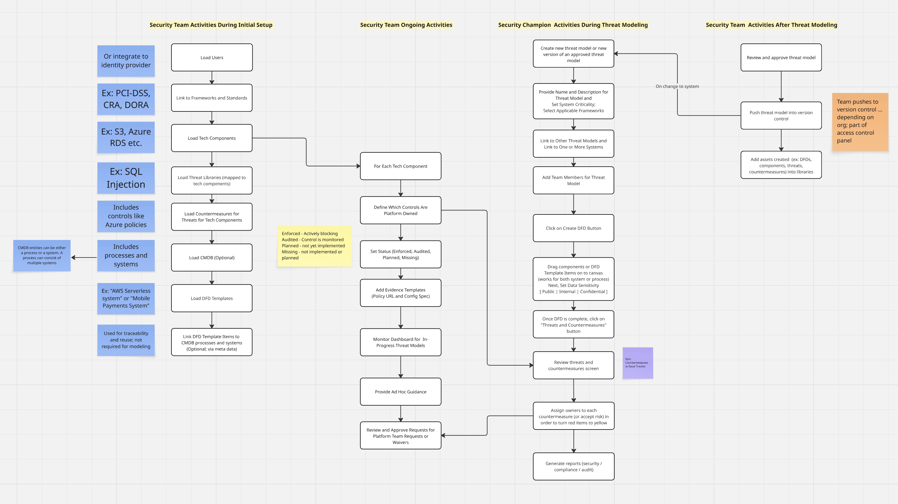

# Precogly README

## What is Precogly?

Precogly is an open-source threat modeling platform purpose-built for compliance.

## Why should I care about Precogly?

## Feature Comparison

| Feature                                            | Open Source Tools | Commercial Tools | Precogly |
| -------------------------------------------------- | ----------------- | ---------------- | -------- |
| Threat Modeling                                    | ✅                | ✅               | ✅       |
| Open source                                        | ✅                | ❌               | ✅       |
| Enterprise support (multi-user, integrations etc.) | ❌                | ✅               | ✅       |
| Compliance-aware                                   | ❌                | ✅               | ✅       |

### What does "compliance-aware" mean?

Say you are a bank, if you choose PCI-DSS and DORA as the frameworks for your org initially, the controls and countermeasures that show up later on will be mapped to these controls enabling you to demonstrate audit readiness.

## What is the tech stack for Precogly?

- **Backend** - Django + DRF
- **Database** - PostgreSQL
- **Frontend** - ReactJS + Vite
- **Canvas Editor** - React Flow
- **State/Data Fetching** TanStack Query
- **Routing** React Router
- **UI Components** shadcn/ui

### Why did you choose Django?

- Django's ORM, migrations, and admin panel lets us model complex compliance, threat, and audit workflows quickly and safely.
- Django has strong, opinionated defaults for authentication, authorization, and auditability - critical for an enterprise-class product.
- Python integrates easily with agentic AI and future automation pipelines.
- Ecosystem maturity - Django is over 20 years old.

### Why did you choose ReactJS?

- Supports canvas-heavy UI like DFDs.
- Best-in-class libraries for graphs, collaboration, and enterprise UI patterns.

## What is the workflow of Precogly?

Check out this 

## How do I get started?

Clone the repo. Start the Django backend. Start the React frontend. Start hacking! If you run into issues, email me - vikramsnarayan@gmail.com
