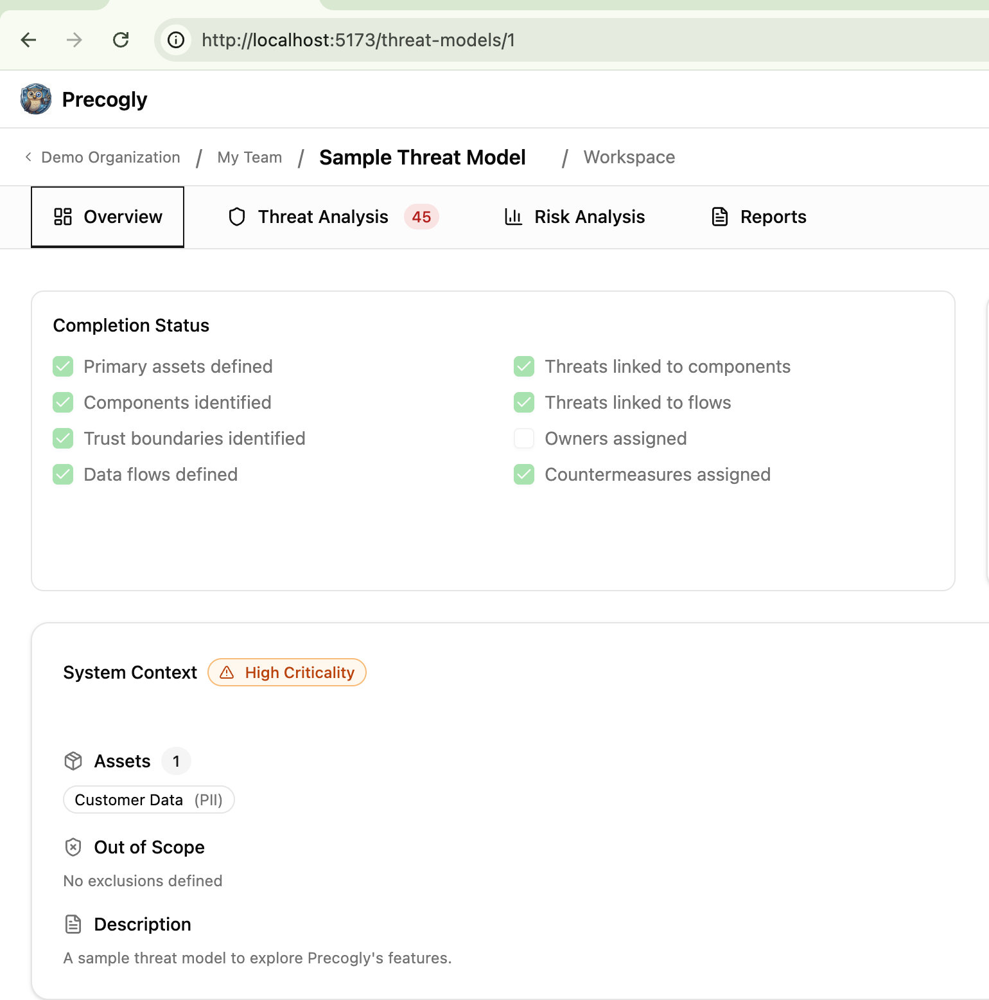

# Completion Status

The completion status checklist tracks how complete a threat model is across 8 key areas. It appears on the Overview tab of every threat model and updates automatically as you build out your model.

## Checklist items

All 8 items are auto-computed from actual data. There are no manual overrides.

| Item | Checked when |
| ---- | ------------ |
| Primary assets defined | At least one data asset exists |
| Components identified | Any process or datastore node exists in a DFD |
| Trust boundaries identified | Any trust zone exists in a DFD |
| Data flows defined | Any edges exist in a DFD |
| Threats linked to components | At least one non-dismissed threat is linked to a component |
| Threats linked to flows | At least one non-dismissed threat is linked to a data flow |
| Owners assigned | Any countermeasure has an assigned owner |
| Countermeasures assigned | Any countermeasure exists for in-scope components or flows |

## How it works

The backend computes the checklist fresh on every request. Nothing is stored or cached. The checkboxes in the UI are read-only and reflect the current state of the threat model data.

Dismissed threats do not count toward the "Threats linked" items. Only active, non-dismissed threats satisfy those checks.

## Where it appears

The checklist surfaces on the Overview tab, in magic link shared views, and in exported reports.
