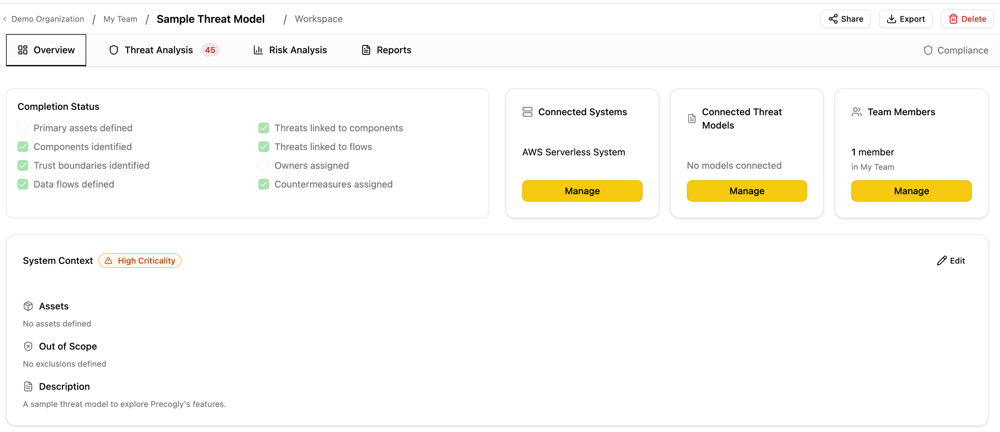
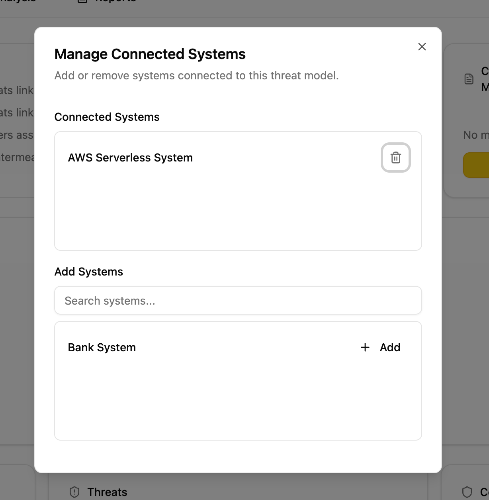
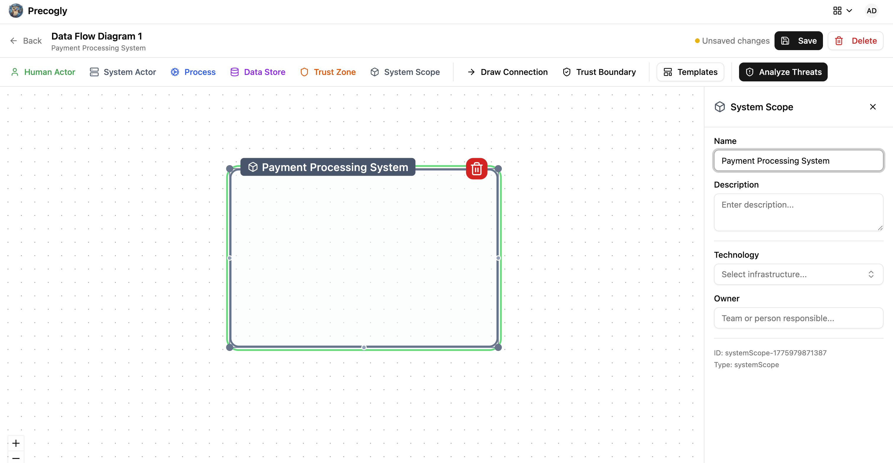
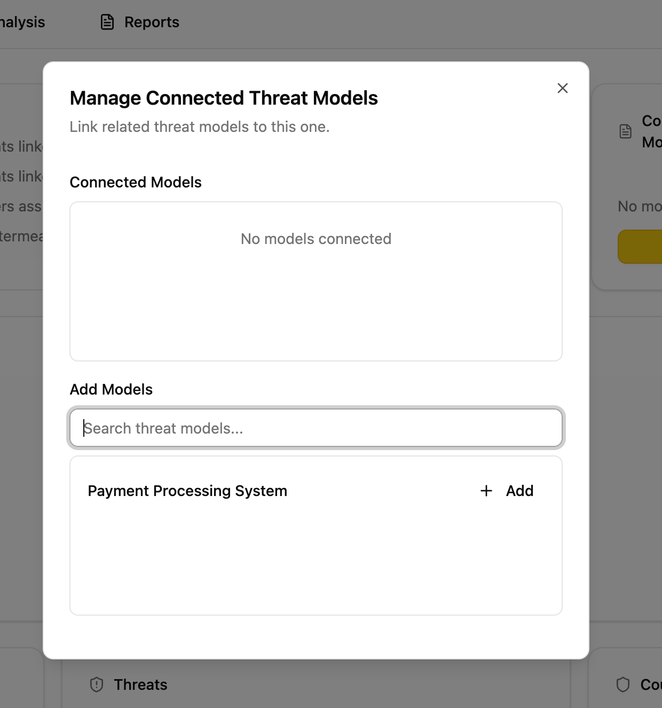

# Connected Systems and Threat Models

Every threat model can link to two types of external resources: **systems** (organizational assets you are analyzing) and **other threat models** (related analyses). Both are managed from the relationship cards on the Overview tab.

## Connected Systems

A connected system answers the question: **"What am I analyzing?"**

Systems represent organizational assets registered in your system inventory (applications, services, platforms). Linking a system to a threat model establishes scope: it declares which systems this analysis covers.

### How it works

1. Open a threat model and navigate to the **Overview** tab.
2. On the **Systems** relationship card, click **Manage**.
3. Search for and add systems from your organization's inventory.

### Where systems come from

Systems appear in the "Add Systems" list when they exist as `Orgsystem` records in your organization. There are two ways a system gets created:

1. **Manually.** An admin creates a system in the system inventory.
2. **Automatically from DFD System Scope nodes.** When you place a System Scope node on a data flow diagram and save, Precogly automatically creates a corresponding system record in the inventory and connects it to the threat model. For example, the sample threat model's DFD includes a System Scope node labeled "AWS Serverless System", which creates a system record that is auto-connected to that threat model and also available for other threat models in the same organization.

This means your system inventory grows organically as teams build DFDs. Every System Scope node placed on any DFD becomes a reusable system that other threat models can reference.

### Side effects

Connecting a system has a functional consequence beyond metadata:

- **Component auto-assignment.** When you create a new component inside a threat model that has exactly one connected system, that component is automatically assigned to that system. This saves manual assignment when a threat model is scoped to a single system.
- If multiple systems are connected, auto-assignment does not occur and components must be assigned manually.

### When to use

- You are threat-modeling a specific application, service, or platform
- You want components created in this model to inherit a system assignment
- You want to track which systems have threat models (for coverage reporting)

## Connected Threat Models

A connected threat model answers the question: **"What else is related?"**

This is an informational cross-reference between analyses. It has no functional side effects. It simply helps teams navigate between related work.

### How it works

1. Open a threat model and navigate to the **Overview** tab.
2. On the **Threat Models** relationship card, click **Manage**.
3. Search for and add other threat models from your organization.

### Relationship types

The underlying data model supports typed relationships (depends on, subsystem of, related to, superseded by). Currently the UI uses **related to** for all connections.

### When to use

- A threat model covers a subsystem of a larger model
- Two models share trust boundaries or data flows
- A newer model supersedes an older one
- Teams want to discover related analyses during review

## Comparison

| Aspect | Connected Systems | Connected Threat Models |
|--------|-------------------|------------------------|
| Purpose | Define analysis scope | Cross-reference related work |
| Links to | Organizational systems (inventory) | Other threat models |
| Side effects | Component auto-assignment | None |
| Directionality | Undirected (simple association) | Directed (source references target) |
| Self-reference | Allowed | Prevented |
