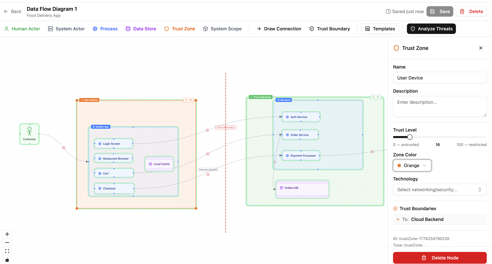
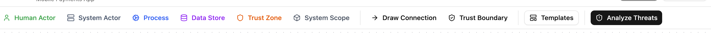
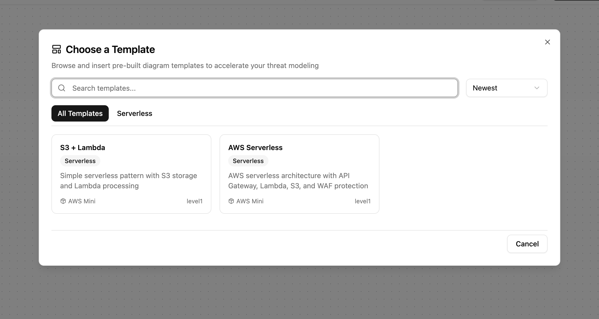
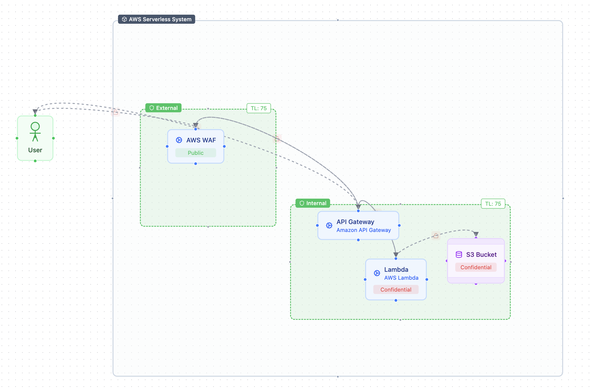

# DFD Editor

The DFD editor is where you visually model your system — place components, draw data flows, define trust zones, and mark trust boundaries.

## Toolbar

| Button | What it does |
|--------|-------------|
| **Human Actor** | External human (customer, admin) |
| **System Actor** | External system (third-party API, partner service) |
| **Process** | Service, API, or function that handles data |
| **Data Store** | Database, file system, or cache |
| **Trust Zone** | Security zone with a trust level (DMZ, VPC) |
| **System Scope** | Visual grouping that defines analysis boundary |
| **Draw Connection** | Draw data flows between components |
| **Trust Boundary** | Create security boundaries between trust zones |
| **Templates** | Insert pre-built diagrams from library packs |
| **Analyze Threats** | Save and navigate to threat analysis |

Click any component button to place it on the canvas. Its editing panel opens on the right.

## Components

| Type | Visual | Key properties |
|------|--------|---------------|
| **Human Actor** | Green, stick figure | Actor type (User, Admin, Engineer, ...) |
| **System Actor** | Gray, server icon | System type, Vendor |
| **Process** | Blue, gear icon | Technology, Data sensitivity, Parent process |
| **Data Store** | Purple, cylinder | Technology, Store type, Data sensitivity |
| **Trust Zone** | Dashed border, shield | Trust level (0–100 slider), Zone color |
| **System Scope** | Solid border, box | Technology, Owner |

Technology dropdowns are populated from your imported library packs. All components support a description field and can be linked to data assets. Drag components into a Trust Zone, System Scope, or Process to nest them (up to 3 levels for process-to-process nesting).

## Data flows and trust boundaries

**Data flows** connect components. Click **Draw Connection**, click the source node, then click the target. Select a flow to set its protocol, encryption/authentication flags, data classification tags (PII, PHI, Financial, ...), and trust zone crossing.

**Trust boundaries** mark the security perimeter between two trust zones. Click **Trust Boundary**, click the first zone, then the second. The boundary line color indicates posture: red (unconfigured), amber (partial), green (both auth and access control). Select a boundary to configure access control (RBAC, ACL, ...), authentication (SSO, Token, MFA, ...), and token settings.

## Templates

Click **Templates** to browse pre-built diagrams from your library packs. Search by name, filter by category, and click to insert. Components with library links carry over their threats and countermeasures automatically.

## Keyboard shortcuts

| Shortcut | Action |
|----------|--------|
| **Cmd/Ctrl + S** | Save |
| **Cmd/Ctrl + Z** / **Shift + Z** | Undo / Redo |
| **Cmd/Ctrl + A** | Select all |
| **Escape** | Deselect / cancel connection |
| **Delete / Backspace** | Delete selected |
| **Cmd/Ctrl + C / V / D** | Copy / Paste / Duplicate |
| **Cmd/Ctrl + 0** | Fit to view |

Auto-saves every 30 seconds. Manual save with **Cmd/Ctrl + S**.

!!! info "Relationship to DFD3"
    Our editor is a superset of Adam Shostack's [DFD3 specification](https://github.com/adamshostack/DFD3) — the five canonical symbols map directly: External Entity becomes Human Actor + System Actor (we split the two), Process and Data Store are unchanged, Data Flows are arrows, and Trust Boundaries are modeled as trust zones (containers) with explicit boundary edges between them. We add System Scope, nested processes, trust levels, security posture indicators, and compliance metadata on top of the base spec. Any DFD3 diagram can be expressed in Precogly.
