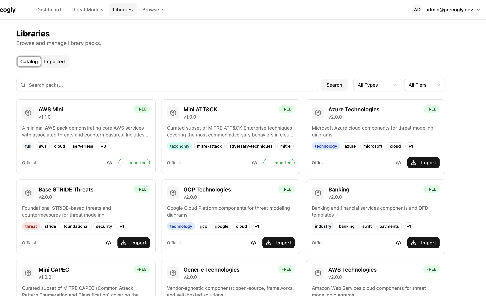
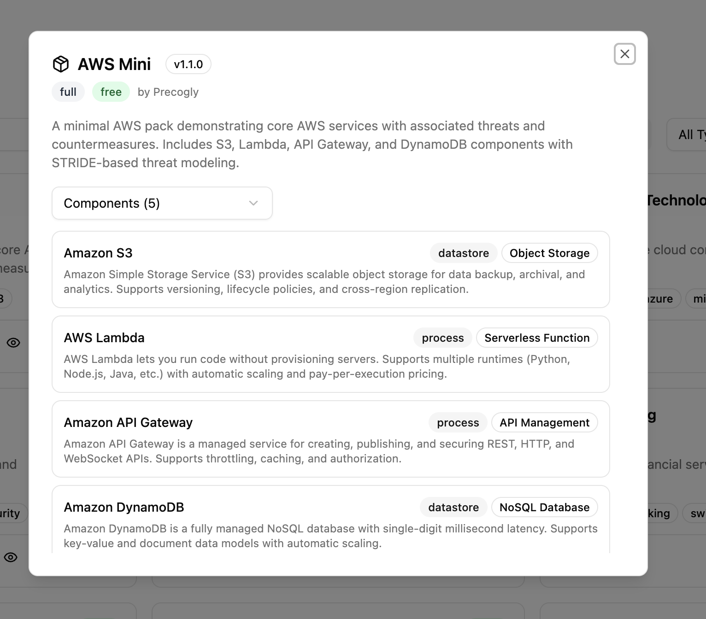
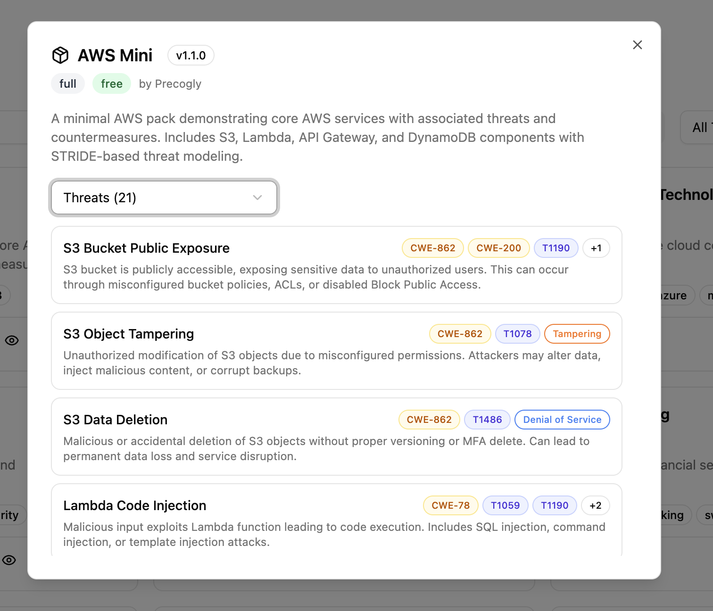
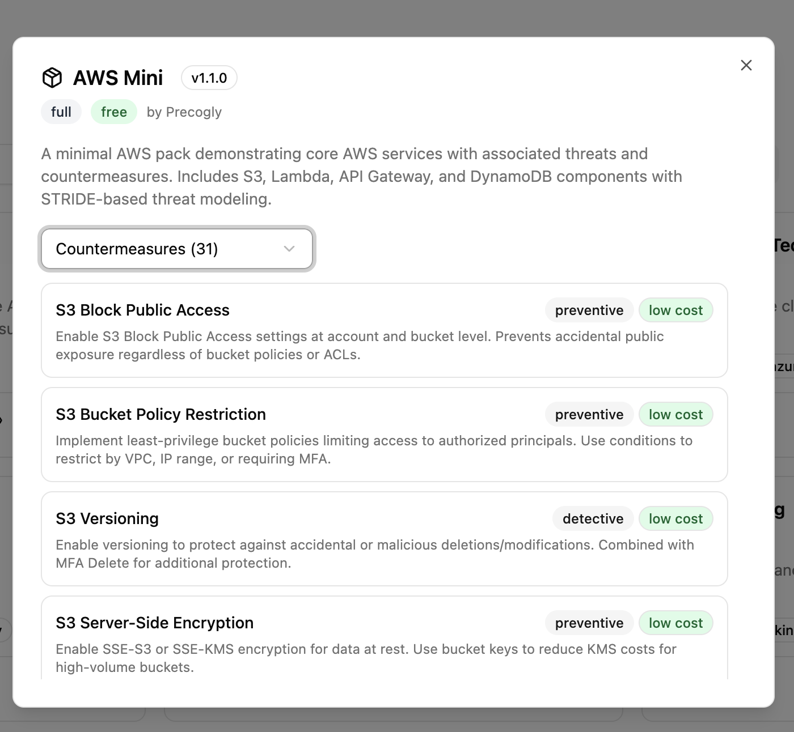
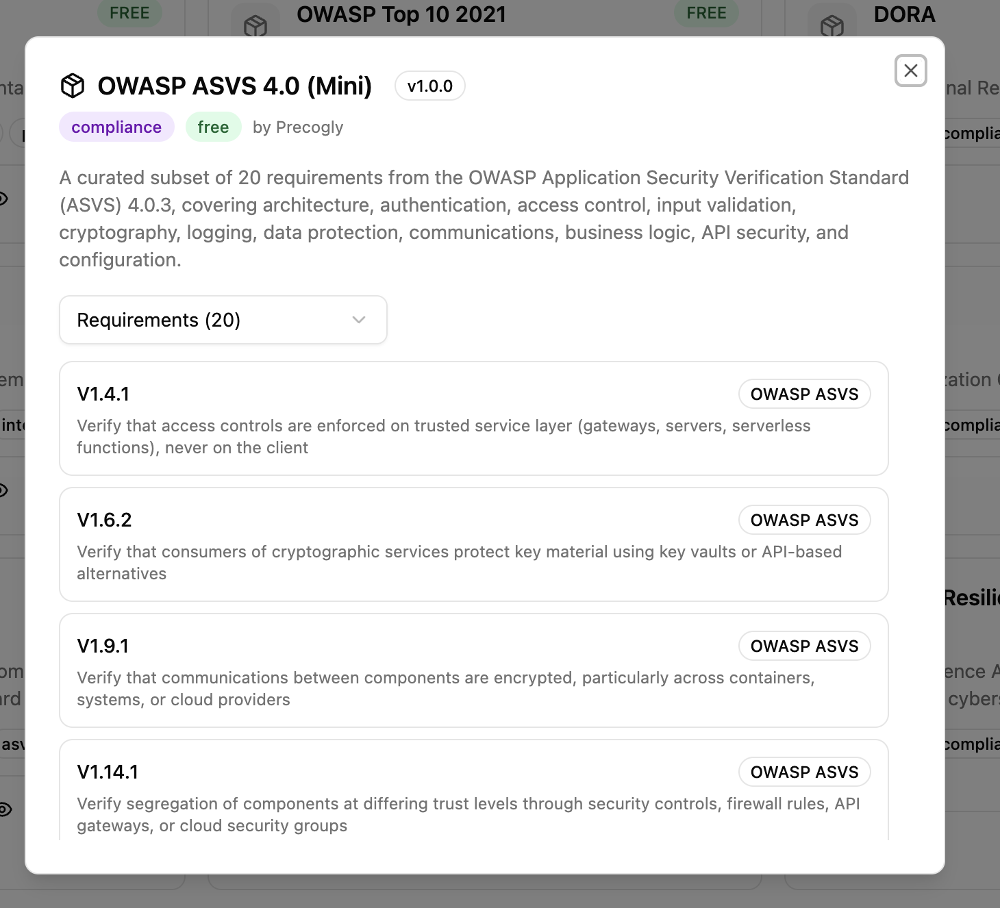
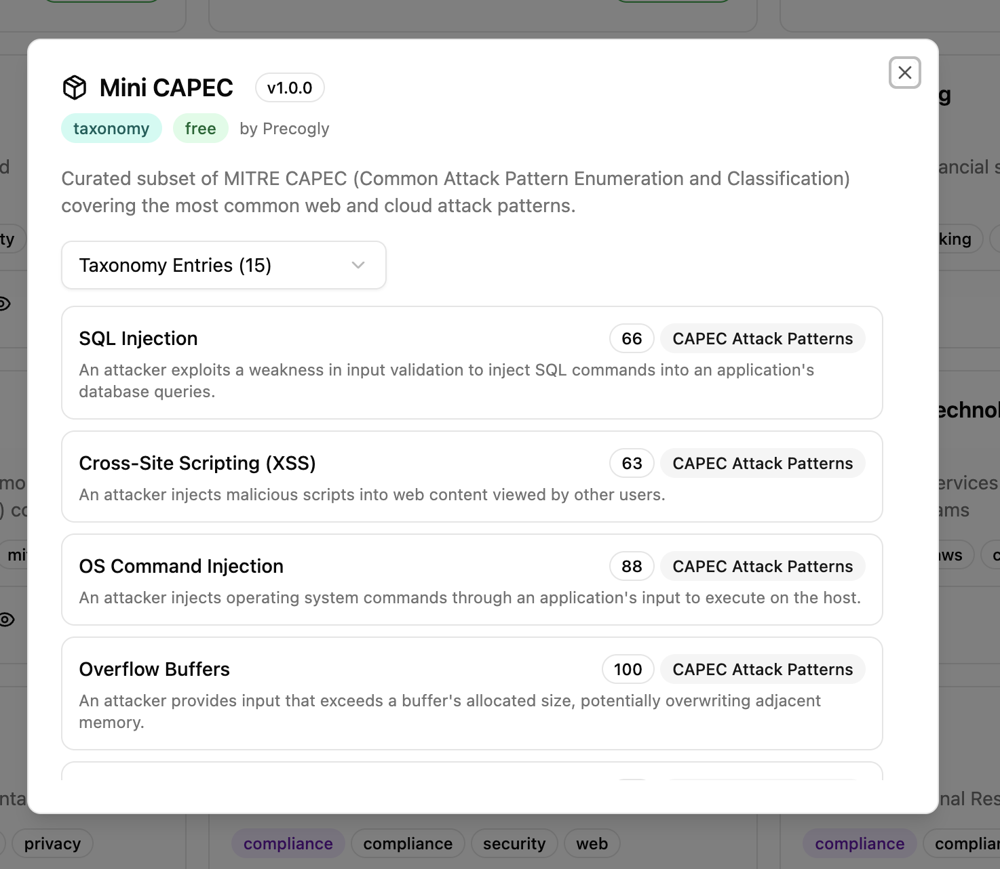
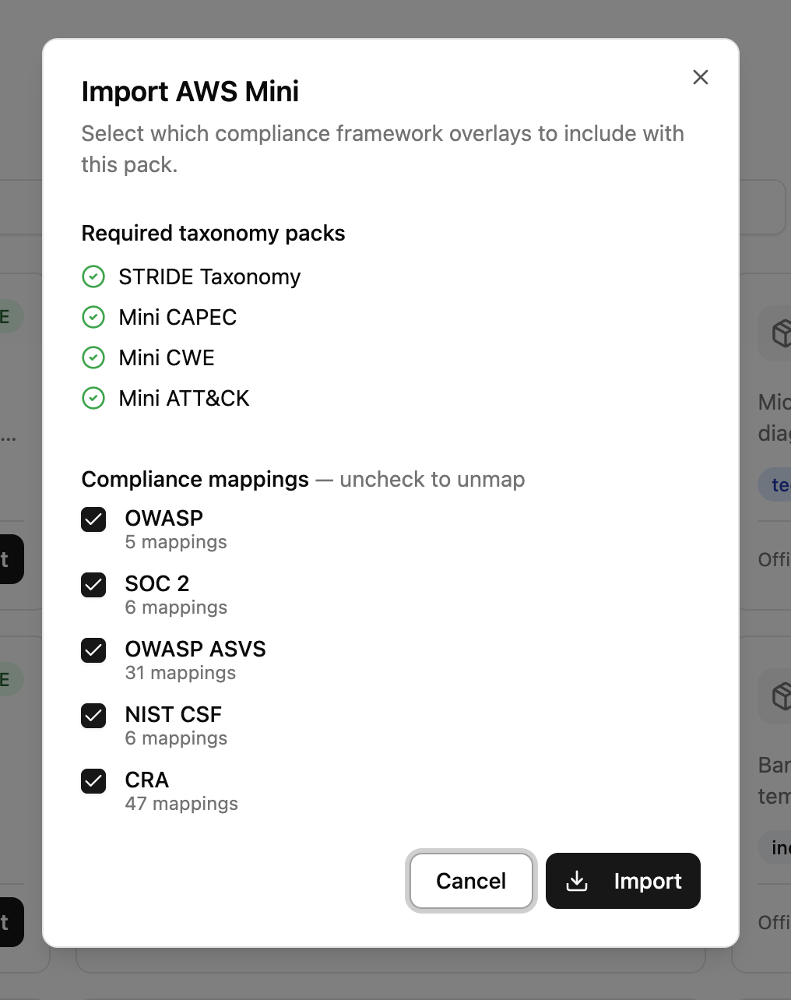
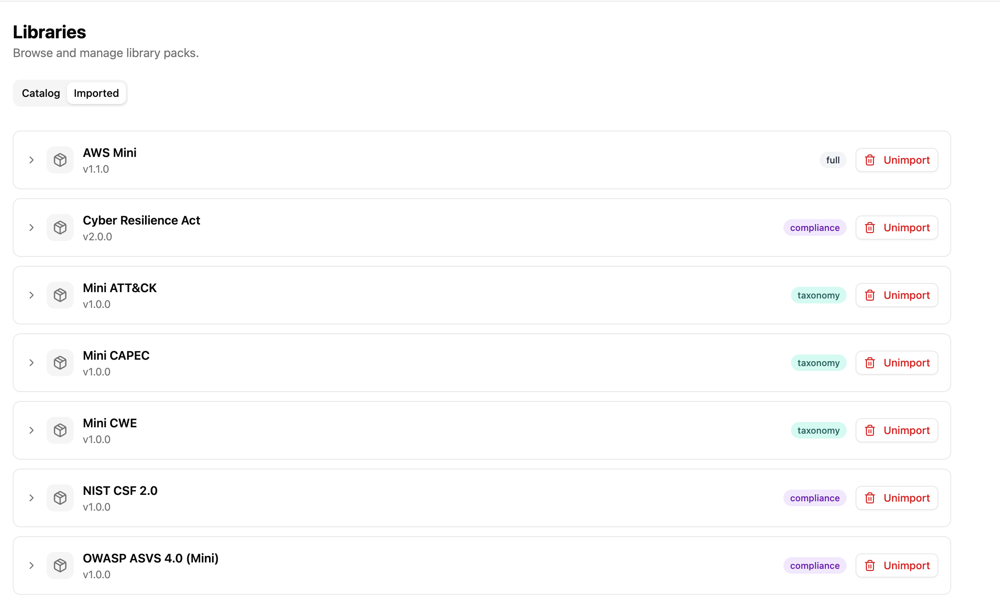

# Library Packs

Library packs are modular bundles of threat-modeling content that you import into your Precogly organization. They provide a structured starting point so your team doesn't have to build threat models from scratch.

## What's in a library pack?

A pack can contain any combination of:

- **Components** — technology building blocks (e.g., Amazon S3, API Gateway, PostgreSQL)
- **Threats** — what can go wrong for each component (e.g., S3 Bucket Public Exposure)
- **Countermeasures** — security controls that mitigate threats (e.g., S3 Block Public Access)
- **Taxonomy mappings** — links from threats to STRIDE, MITRE ATT&CK, CAPEC, CWE
- **Compliance mappings** — links from countermeasures to standards like NIST CSF, ASVS, SOC 2, PCI-DSS
- **DFD templates** — pre-built Data Flow Diagrams with components already wired up

When you add a component from a library pack to your threat model, its associated threats and countermeasures come with it — along with all taxonomy and compliance links.



## Pack types

| Type | Contains | Example |
|------|----------|---------|
| `technology` | Components only | `aws`, `azure`, `gcp` |
| `threat` | Threats + countermeasures | `base-stride` |
| `full` | Components + threats + countermeasures + joins + templates | `aws-mini` |
| `industry` | Industry-specific components + templates | `banking` |
| `compliance` | Framework definitions with requirements | `nist-csf`, `pci-dss` |
| `taxonomy` | External threat classification taxonomies | `stride-taxonomy`, `mini-capec` |
| `template` | DFD templates only | — |

## YAML structure

Every pack is a directory under `libraries/packs/`. Only `pack.yaml` is required — other files depend on the pack type.

```
aws-mini/
├── pack.yaml                    # Pack metadata (required)
├── components.yaml              # Component definitions
├── threats.yaml                 # Threat definitions
├── countermeasures.yaml         # Countermeasure definitions
├── joins/
│   ├── components-threats.yaml         # Which threats apply to which components
│   ├── threats-countermeasures.yaml    # Which countermeasures mitigate which threats
│   ├── threats-stride.yaml            # Threat → STRIDE mappings
│   ├── threats-cwe.yaml               # Threat → CWE mappings
│   ├── threats-capec.yaml             # Threat → CAPEC mappings
│   ├── countermeasures-nist-csf.yaml  # Countermeasure → NIST CSF mappings
│   └── countermeasures-soc2.yaml      # Countermeasure → SOC 2 mappings
└── dfd-templates/
    └── s3-lambda.yaml           # Pre-built DFD template
```

### pack.yaml

```yaml
pack:
  slug: aws-mini
  name: AWS Mini
  version: 1.1.0
  pack_type: full
  description: |
    A minimal AWS pack with core services,
    threats, and countermeasures.
  tier: free
  source: official
  author: Precogly
  tags:
    - aws
    - cloud
  depends_on:
    - pack: base-stride
      version: "^1.0.0"
```

Here's how the YAML maps to what you see in the UI when previewing a pack:











### components.yaml

```yaml
components:
  - id: s3
    name: Amazon S3
    category: datastore          # process | datastore | human_actor | system_actor
    type: Object Storage
    provider: aws
    description: |
      Amazon Simple Storage Service for scalable object storage.
```

### threats.yaml

```yaml
threats:
  - id: s3-public-exposure
    name: S3 Bucket Public Exposure
    description: |
      S3 bucket is publicly accessible, exposing sensitive data.
```

### countermeasures.yaml

```yaml
countermeasures:
  - id: s3-block-public-access
    name: S3 Block Public Access
    description: |
      Enable S3 Block Public Access at account and bucket level.
    control_type: preventive     # preventive | detective | corrective
    cost: low                    # low | medium | high
```

### Join files

Join files in the `joins/` directory define relationships between items.

**components-threats.yaml** — which threats apply to which components:

```yaml
mappings:
  - component: s3
    threats:
      - threat: s3-public-exposure
        applies_to: component    # component | flow | both
```

**threats-countermeasures.yaml** — which countermeasures mitigate which threats:

```yaml
mappings:
  - threat: s3-public-exposure
    countermeasures:
      - s3-block-public-access
      - s3-bucket-policy
```

**threats-{taxonomy}.yaml** — maps threats to taxonomy entries:

```yaml
taxonomy: stride

mappings:
  - threat: s3-public-exposure
    entries: [information-disclosure]
```

**countermeasures-{framework}.yaml** — maps countermeasures to compliance requirements:

```yaml
framework: nist-csf-2

mappings:
  - countermeasure: s3-bucket-policy
    requirements:
      - "PR.AC-4"
    sufficiency: full            # full | partial
```

## How to import a library pack

!!! note "Import requires Security Team role"
    The **Import** button is only visible to users with the **Security Team** organization role. If you don't see the Import button, ask your organization admin to update your role from **Member** to **Security Team** in the organization settings.

1. Navigate to the **Library Packs** section from the sidebar
2. Browse available packs — you can filter by type, tier, or search by name
3. Click on a pack to preview its components, threats, and countermeasures
4. Click **Import** to add it to your organization

Packs with dependencies (e.g., `aws-mini` depends on `base-stride`) will show which dependencies need to be imported. Dependencies are **not enforced** — you can import a pack without its taxonomy dependencies if you don't need taxonomy enrichment (STRIDE, CAPEC, CWE tags on threats). Import taxonomy packs first if you want full taxonomy linking.



!!! info "Compliance overlay selection"
    When importing a pack, you can choose which compliance framework mappings to include. For example, import only NIST CSF mappings without SOC 2 if that's all you need.

## How to unimport a library pack

1. Navigate to the **Library Packs** section
2. Switch to the **Imported** tab
3. Find the pack and click **Unimport**



Unimporting removes the library definitions (components, threats, countermeasures) but **does not delete** any threat model data you've already created using that pack. Your existing threat models keep their data — they just lose the link back to the library definition.

!!! warning
    You cannot unimport a pack if other imported packs depend on it. Unimport the dependent packs first.

**Taxonomy packs vs. compliance packs:** Taxonomy packs (STRIDE, CAPEC, CWE, etc.) cannot be unimported while content packs that reference them are still imported — taxonomies directly enrich threat data. Compliance packs (NIST CSF, ASVS, etc.) can be unimported independently since compliance mappings are optional and degrade gracefully.

## How to author a library pack

Creating your own pack involves writing YAML files following the structure above. For the complete authoring guide with field references, validation checklists, DFD template syntax, and cross-pack references, see:

[`libraries/README.md`](https://github.com/precogly/precogly/blob/main/libraries/README.md)

## Troubleshooting

**Imported a pack but taxonomy tags are missing on threats**
: Taxonomy packs (STRIDE, CWE, CAPEC, etc.) must be imported **before** the content pack that references them. If you imported without taxonomy dependencies, the components, threats, and countermeasures are fine — but taxonomy links (e.g., STRIDE categories on threats) won't be present. To fix this, unimport the pack, import the taxonomy packs, then re-import.

**Taxonomy mappings not showing up**
: Same as above — taxonomy packs must be imported first. The seed data imports taxonomies first for this reason.

**Compliance mappings not appearing**
: If the compliance framework pack (e.g., `nist-csf`) wasn't imported when the content pack was imported, the mappings are stored as pending. Import the framework pack and the mappings will activate automatically.

**Unimport blocked**
: Another pack depends on the one you're trying to remove. Check which packs list it in their `depends_on` and unimport those first. Note that taxonomy packs are protected this way because they enrich threat data, while compliance packs can be unimported freely since their mappings are optional.
