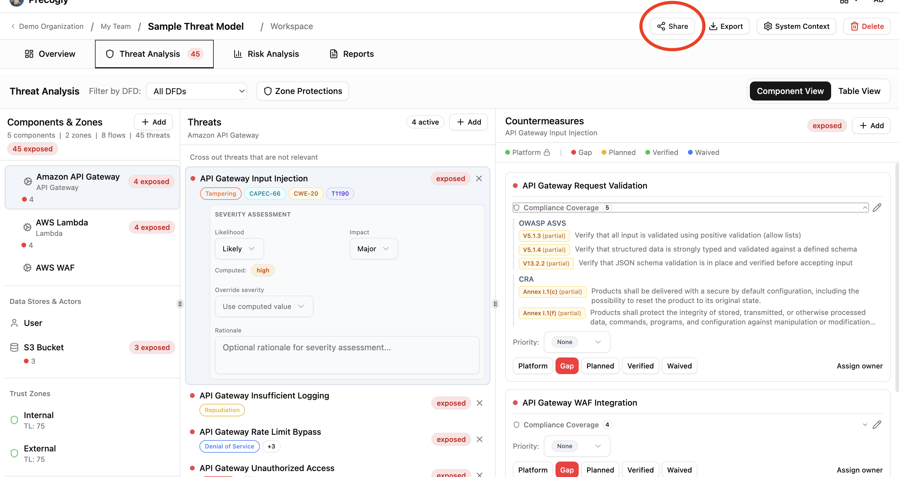
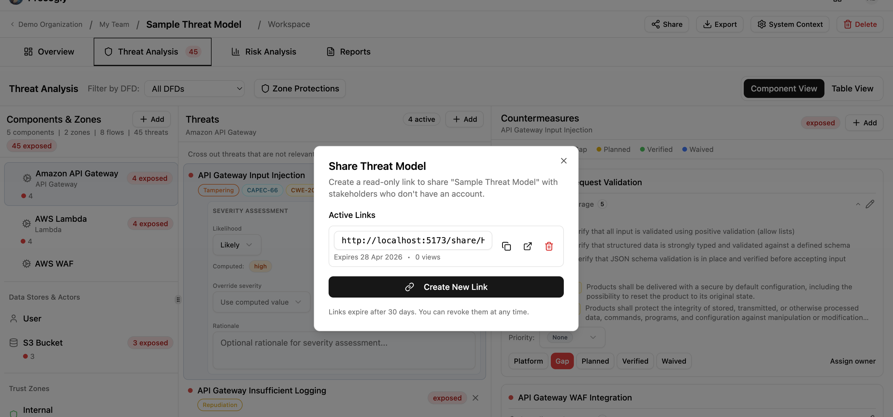
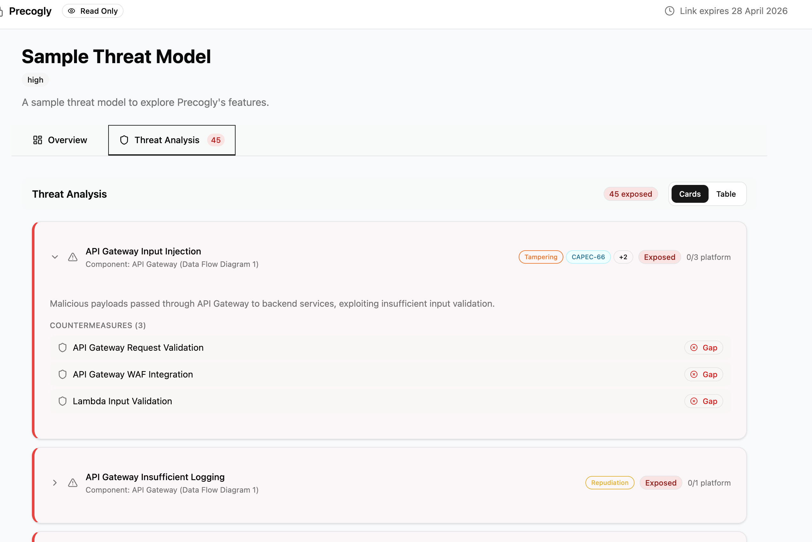

# Magic Links

Magic links let you share a read-only view of a threat model with anyone, no account required. Generate a tokenized URL, send it to a stakeholder or auditor, and they can view the full threat model in their browser.

## Creating a magic link

From any threat model's detail page, click the **Share** button in the top toolbar. This opens the magic link dialog.

Click **Create New Link** to generate a shareable URL. The link appears in the dialog with a copy button. Click it to copy the full URL to your clipboard.

## What the shared view includes

Recipients see a comprehensive, read-only view of the threat model:

- **Overview**: completion checklist, summary statistics (component counts, threat counts, countermeasure counts), system context, data assets, and out-of-scope items.
- **DFD diagrams**: all data flow diagrams with full canvas rendering.
- **Reference images**: any uploaded reference images, viewable in a grid.
- **Threat analysis**: all threats with their severity, status, taxonomy entries, countermeasures, compliance mappings, and assigned owners.

## Expiration and revocation

Every magic link expires **30 days** after creation. The expiration date is shown both in the magic link dialog and in the shared view header.

To revoke a link before it expires, open the Share dialog and click the delete icon next to the link. Revoked links stop working immediately. Anyone who tries to access a revoked or expired link sees an error page.

## Access tracking

Each link tracks how many times it has been viewed. The view count appears next to the link in the Share dialog, so you can see whether stakeholders have actually opened it.

Access tracking is aggregate only. You can see the total view count, but not who accessed the link or when individual views occurred.

## Shared with Me

When a logged-in user opens a magic link, the threat model is automatically saved to their **Shared with Me** section on the Threat Models page. This gives them quick access without needing to keep the link.

Each entry shows:

- The threat model name and organization
- Who shared it
- When it was last viewed
- A direct link to the shared view (if the link is still valid)

Users can remove items from this list at any time. Expired or revoked links show a "Link expired" badge instead of a view button.

## Security considerations

Magic links grant access to the **full threat model**, including all threats, countermeasures, compliance mappings, and architectural diagrams. Treat them like passwords:

- **Anyone with the link can view the threat model.** No authentication is required.
- **Links cannot be scoped.** You cannot limit a link to show only certain sections or redact sensitive data.
- **Revoke links when no longer needed.** Don't rely solely on the 30-day expiration.
- **Share links through secure channels.** Prefer direct messages rather than public channels.
