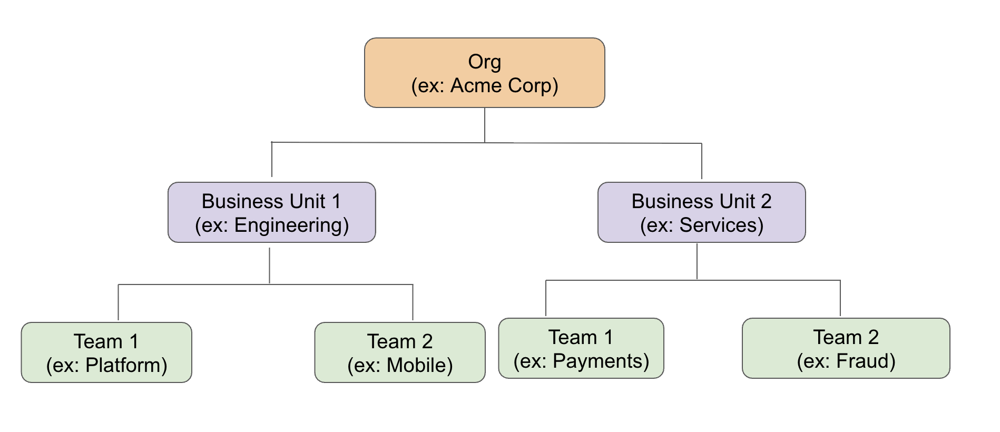
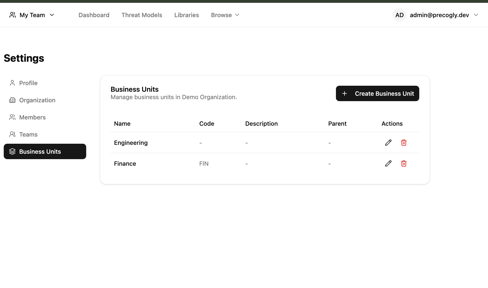
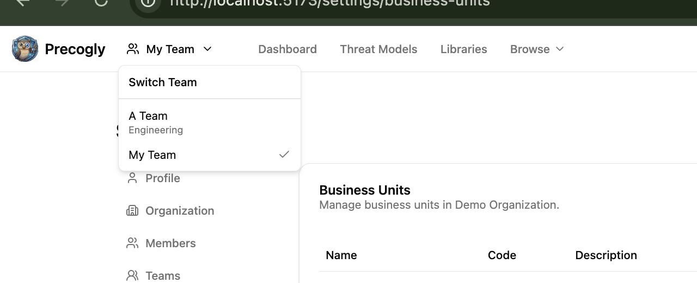
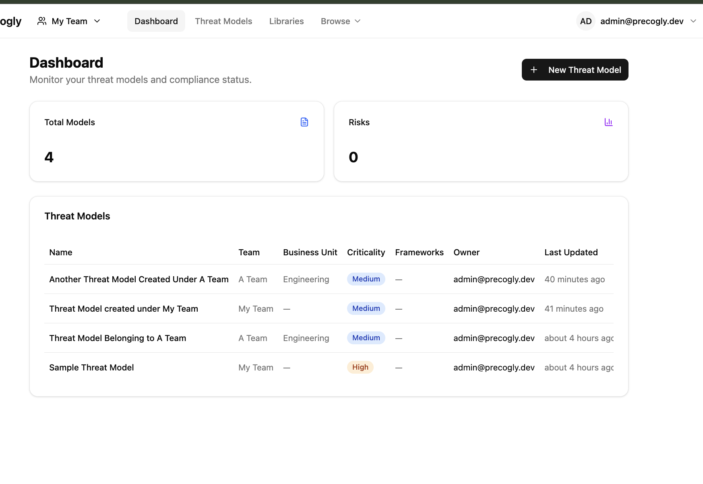

# Org Hierarchy

Precogly organizes work in a three-level hierarchy: **organizations**, **business units**, and **teams**. Teams are the unit that owns threat models.

## Organizations

An organization is the top-level tenant. All business units, teams, threat models, and library packs belong to an organization. Users can belong to multiple organizations.

One organization can be marked as the **primary organization**. When new users sign up, they are automatically added to the primary organization and its default team — no invitation needed.

## Business units

Business units are an optional grouping layer between the organization and its teams. Use them to mirror your company structure — departments, divisions, product areas, or however you organize internally.

Business units are flexible:

- **Optional** — teams can exist directly under an organization without a business unit.
- **Nestable** — a business unit can have sub-units (e.g., Engineering > Backend > API).

Business units are managed in **Settings > Business Units**. Security Team members can create, edit, and delete business units. Each business unit has a name, an optional code, a description, and an optional parent for nesting.

## Teams

Teams are where work happens. Every threat model is owned by exactly one team, and team membership determines who can view and edit it. Teams can optionally belong to a business unit, but they don't have to — a team can sit directly under the organization.

A team can be marked as the **default team**. New members added to the organization are automatically assigned to the default team, giving them immediate access to shared threat models.

Users can belong to multiple teams within an organization. A security analyst might be on both the Platform team and the Payments team, seeing threat models from both.

### Team switcher

When a user belongs to multiple teams, a team switcher appears in the navigation bar. The switcher shows each team with its business unit name underneath for context. Switching teams controls which team new threat models are created under.

The **Dashboard** and **Threat Models** pages always show all threat models across all your teams, with Team and Business Unit columns for cross-team visibility. The team switcher only affects which team is pre-selected when creating new threat models.

### Team roles

Each team member has a role — **Lead**, **Member**, or **Viewer** — that controls what they can do with the team's threat models.

|                                                    | Lead | Member | Viewer |
| -------------------------------------------------- | ---- | ------ | ------ |
| View team's threat models                          | Yes  | Yes    | Yes    |
| Create/edit threat models                          | Yes  | Yes    | No     |
| Edit components, threats, countermeasures          | Yes  | Yes    | No     |
| Manage team members (invite, remove, change roles) | Yes  | No     | No     |

Additionally, **Security Team** (org-level role) bypasses all team-level checks — they get unconditional write access across the entire organization regardless of team membership.

See [Roles and Permissions](roles-and-permissions.md) for the full access control model.
