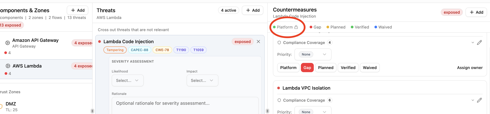

# Platform Controls

Platform controls are countermeasures handled at the infrastructure level rather than by individual application teams. They represent security capabilities built into the platform itself, such as WAF filtering, managed encryption, or network segmentation. Only [Security Team](roles-and-permissions.md) members can assign platform status.

## Platform vs verified

Both platform and verified fully mitigate a threat and are treated as 100% effective in risk scoring. The difference is ownership:

- **Verified**: the application team has confirmed this control is in place.
- **Platform**: this control is provided by infrastructure and managed by the security team.

Platform countermeasures show a lock icon to non-security-team members, who cannot change the status.



## How controls become platform

There are three paths:

### Library pack defaults

Pack authors can set `default_status: platform` on a countermeasure definition. When that countermeasure is added to any component, it starts as platform automatically.

```yaml
countermeasures:
  - id: apigw-waf
    name: API Gateway WAF Integration
    description: |
      Enable AWS WAF to protect against common web exploits.
      Block SQL injection, XSS, and known bad actors.
    control_type: preventive
    cost: medium
    default_status: platform
```

If `default_status` is omitted, countermeasures default to `gap`.

### Zone protection inheritance

When a component in an outer zone (lower trust level) has a platform countermeasure, inner-zone components with the same countermeasure as a gap can inherit the protection. The inherited countermeasure is promoted to platform with a label showing its source. See [Zone Protections](zone-protections.md).

### Manual assignment

Security Team members can click the **Platform** button on any countermeasure in the Threat Analysis view. Regular team members do not see this option.

## Effect on threat status

A threat's status is determined by its countermeasures:

| Countermeasure statuses | Threat status |
| ----------------------- | ------------- |
| All verified or platform | **Mitigated** |
| Mix of planned/waived, no gaps | **Addressable** |
| Any gaps present | **Exposed** |

A single gap countermeasure makes a threat exposed, regardless of how many platform or verified controls are in place.

## Who can manage platform controls

Only users with the **Security Team** organization role can assign or remove platform status. Regular team members (Lead, Member, Viewer) see a lock icon next to platform countermeasures and cannot modify them.

This creates a separation of concerns: security teams define and manage infrastructure-level protections, while application teams focus on the remaining gaps within their threat models.
