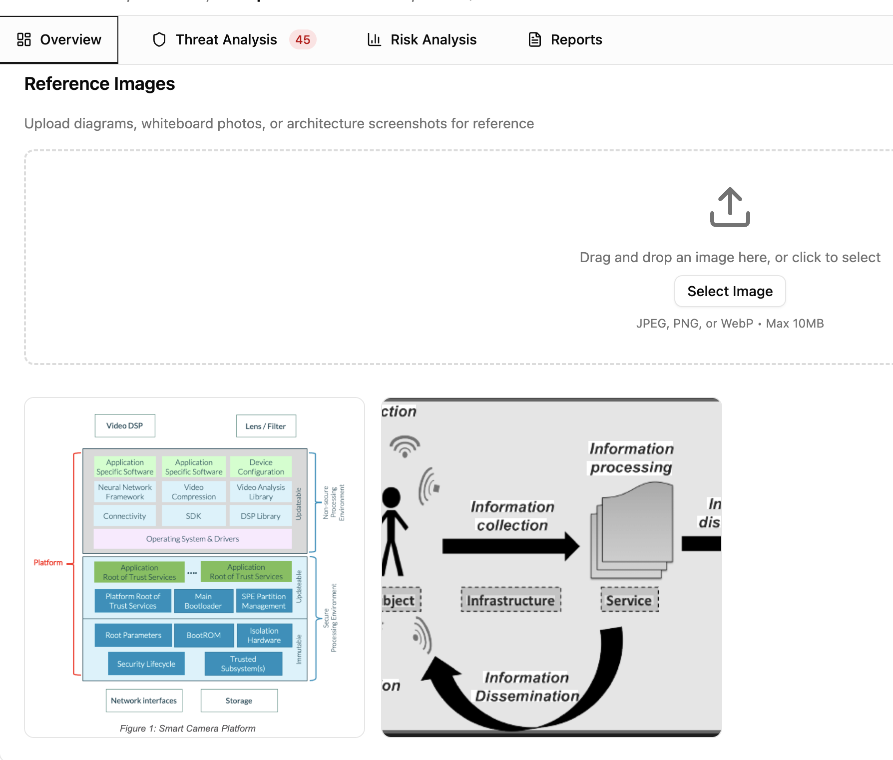
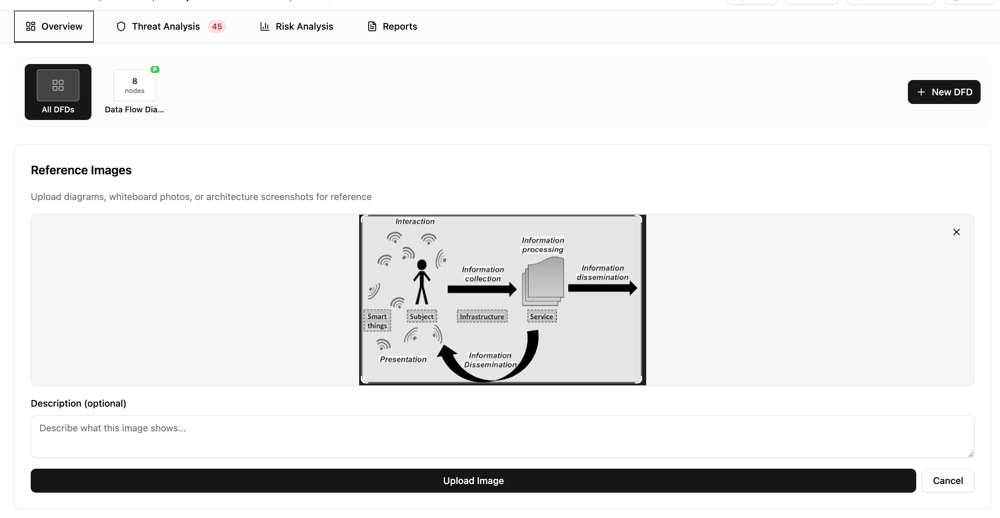

# Reference Images

Threat modeling doesn't happen in a vacuum. Teams sketch on whiteboards, draw sequence diagrams in other tools, and capture architecture in formats that don't fit neatly into a data flow diagram. Reference images let you attach that context directly to the threat model so it stays alongside the analysis, not buried in a separate folder or Slack thread.

## What to attach

Reference images work for any visual context that supports the threat model:

- **Whiteboard photos** from threat modeling sessions or design reviews.
- **Sequence diagrams, C4 models, or architecture diagrams** exported from other tools.
- **Deployment topologies or network diagrams** showing infrastructure layout.
- **Annotated screenshots** from security reviews or audit findings.

## Uploading images

On the Overview tab, drag and drop an image file into the upload area or click to browse. Supported formats are JPEG, PNG, and WebP, up to 10MB per file. You can add an optional description to explain what the image shows.

## Viewing and managing

Uploaded images appear in a responsive grid gallery on the Overview tab. Click any image to open a lightbox viewer with previous/next navigation. The viewer shows the image description, who uploaded it, and when.

To delete an image, hover over it in the gallery and click the delete button. A confirmation dialog prevents accidental deletions. Deleted images are permanently removed from storage.

## Sharing and reports

Reference images are included when you share a threat model via [magic link](magic-links.md). Recipients see the same gallery in read-only mode. Images also appear in exported reports generated from the Reports tab.
