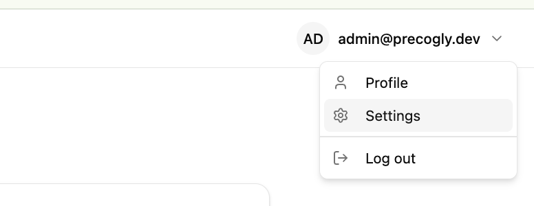
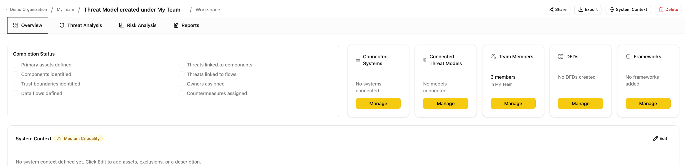

# Roles and Permissions

Precogly uses role-based access control at two levels — **organization** and **team** — to determine who can view, edit, and manage threat models and members.

## Organization roles

Every organization member has one of two roles:

- **Security Team** — full administrative access across the entire organization. Can manage all teams, business units, threat models, and members regardless of team membership.
- **Member** — standard access. Can only view and edit within teams they explicitly belong to.

Organization members are managed in **Settings > Members**. Only Security Team members can change roles or remove members.

## Team roles

Within a team, each member has a role that controls what they can do with that team's threat models:

|                                           | Lead | Member | Viewer |
| ----------------------------------------- | ---- | ------ | ------ |
| View team's threat models                 | Yes  | Yes    | Yes    |
| Create/edit threat models                 | Yes  | Yes    | No     |
| Edit components, threats, countermeasures | Yes  | Yes    | No     |
| Invite and remove team members            | Yes  | Yes    | No     |
| Change team member roles                  | Yes  | Yes    | No     |

**Security Team** (org-level role) bypasses all team-level checks — they get unconditional write access across the entire organization regardless of team membership.

## Threat model visibility

Who can see which threat models depends on the user's org role:

- **Security Team** members see all threat models in the organization.
- **Regular members** see threat models owned by teams they belong to, plus any unassigned threat models (no owning team).

The **Dashboard** and **Threat Models** pages show all accessible threat models across all teams, with Team and Business Unit columns for context.

## Inviting members

### Team invitations

Team members can invite others via **Settings > Teams > Manage** or from the threat model detail page.

The invite flow works by email:

- **Existing user** — added to the team immediately.
- **New user** — a pending invitation is created and an invite link is shown. Copy the link and share it directly (e.g., via Slack or email). Invitations expire after **7 days**.

When an invited user signs up or logs in using the invite link, any pending invitations for their email are **automatically accepted** — they're added to the team and organization without needing to click an accept button.

### Organization members

Organization membership is typically managed automatically:

- **On signup** — new users are added to the primary organization and its default team.
- **On team invite** — accepting a team invitation also adds the user to the organization if they aren't already a member.

To manually add organization-level members or change org roles, use the Django admin panel or **Settings > Members**.

## Read-only sharing via magic links

Threat models can be shared externally using **magic links** — tokenized URLs that grant read-only access without requiring team membership.

- Links expire after **30 days** and can be revoked at any time.
- No authentication is required to view a shared threat model.
- If a logged-in user accesses a magic link, the threat model appears in their **Shared with Me** section on the Threat Models page.

See [Magic Links](magic-links.md) for full details on creating and managing shared links.
