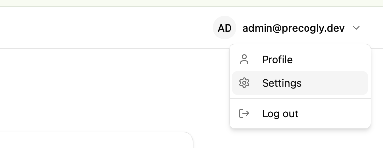
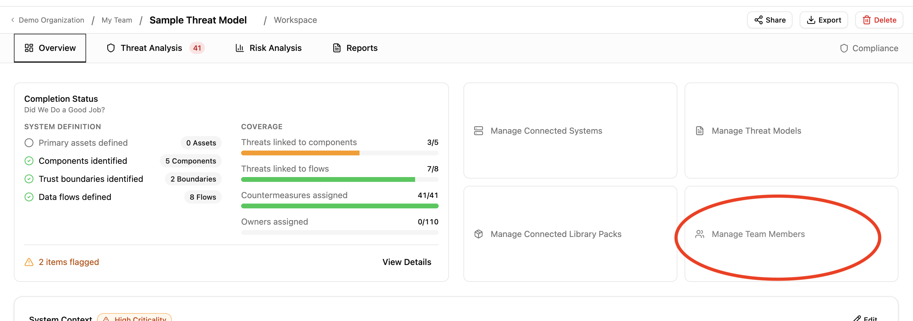

# Roles and Permissions

Precogly uses role-based access control at two levels — **organization** and **team** — to determine who can view, edit, and manage threat models and members.

## Organization roles

Every organization member has one of two roles:

- **Security Team** — full administrative access across the entire organization. Can manage all teams, business units, threat models, and members regardless of team membership.
- **Member** — standard access. Can only view and edit within teams they explicitly belong to.

Organization members are managed in **Settings > Members**. Only Security Team members can change roles or remove members.

Organization roles are intended to be scoped to the organization where the membership exists. If a user belongs to multiple organizations, their Security Team role in one organization should not be treated as administrative authority in another organization. When reviewing API behavior or debugging permissions, always check both the user's organization membership and the organization that owns the object being modified.

## Team roles

Within a team, each member has a role that controls what they can do with that team's threat models:

|                                           | Lead | Member | Viewer |
| ----------------------------------------- | ---- | ------ | ------ |
| View team's threat models                 | Yes  | Yes    | Yes    |
| Create/edit threat models                 | Yes  | Yes    | No     |
| Edit components, threats, countermeasures | Yes  | Yes    | No     |
| Invite and remove team members            | Yes  | Yes    | No     |
| Change team member roles                  | Yes  | Yes    | No     |

**Security Team** (org-level role) bypasses all team-level checks — they get unconditional write access across the entire organization regardless of team membership.

Team roles apply only inside the team where they are assigned. A Lead in one team does not automatically manage another team unless they also hold the Security Team organization role. Member-management actions should be evaluated against the team being changed, while organization-level member actions should be evaluated against the organization being changed.

## Threat model visibility

Who can see which threat models depends on the user's org role:

- **Security Team** members see all threat models in the organization.
- **Regular members** see threat models owned by teams they belong to, plus any unassigned threat models (no owning team).

The **Dashboard** and **Threat Models** pages show all accessible threat models across all teams, with Team and Business Unit columns for context.

## Inviting members

### Team invitations

Team members can invite others via **Settings > Teams > Manage** or from the threat model detail page.

The invite flow works by email:

- **Existing user** — added to the team immediately.
- **New user** — a pending invitation is created and an invite link is shown. Copy the link and share it directly (e.g., via Slack or email). Invitations expire after **7 days**.

When an invited user signs up or logs in using the invite link, any pending invitations for their email are **automatically accepted** — they're added to the team and organization without needing to click an accept button.

In local development, invitation email delivery may use Django's console backend. In that setup the application creates the invitation and prints or returns the link, but no real email is delivered to the recipient. Copy the generated invite link and share it manually when testing team onboarding locally.

### Organization members

Organization membership is typically managed automatically:

- **On signup** — new users are added to the primary organization and its default team.
- **On team invite** — accepting a team invitation also adds the user to the organization if they aren't already a member.

To manually add organization-level members or change org roles, use the Django admin panel or **Settings > Members**.

## Read-only sharing via magic links

Threat models can be shared externally using **magic links** — tokenized URLs that grant read-only access without requiring team membership.

- Links expire after **30 days** and can be revoked at any time.
- No authentication is required to view a shared threat model.
- If a logged-in user accesses a magic link, the threat model appears in their **Shared with Me** section on the Threat Models page.

See [Magic Links](magic-links.md) for full details on creating and managing shared links.

Magic links are intentionally different from organization and team membership. They grant read-only access to a single shared threat model and do not add the recipient to the owning organization or team. Use team invitations when the recipient should become a collaborator, and use magic links when the recipient only needs read-only review access.
