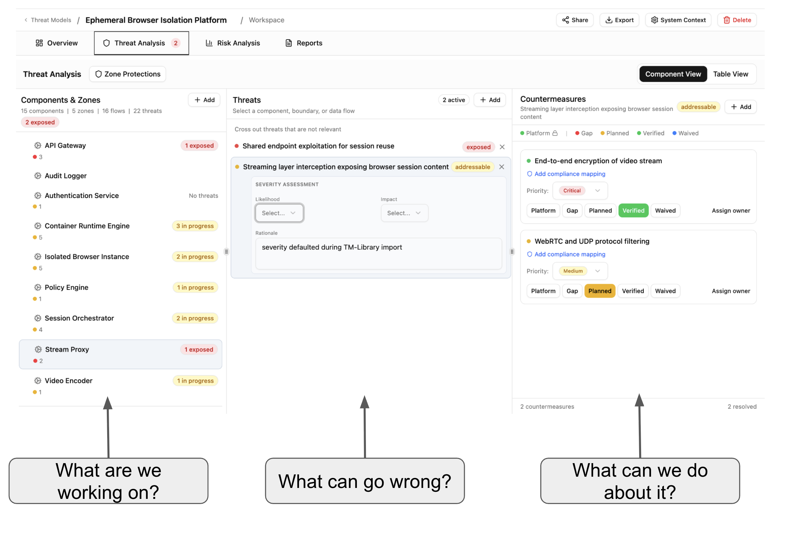
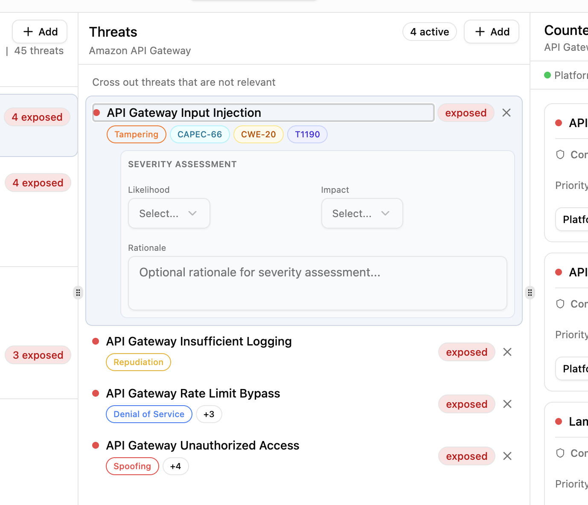
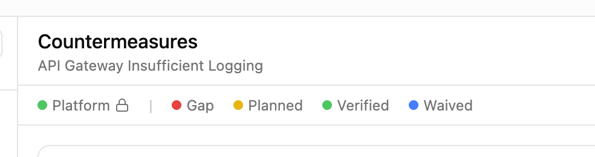
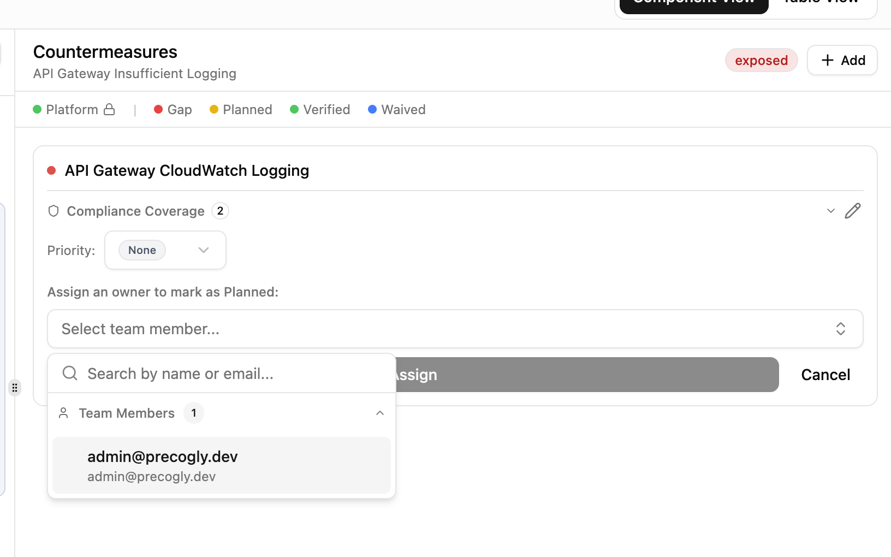
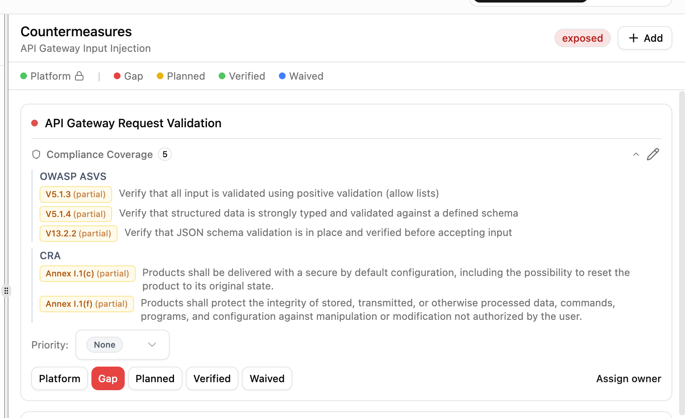

# Threat Analysis

The threat analysis view is the three-panel workspace where you review components, assess threats, and track countermeasures. Each panel answers one question: *what are we working on?*, *what can go wrong?*, and *what can we do about it?*

Select a component in the left panel to see its threats. Select a threat to see its countermeasures. Each threat shows a severity assessment (likelihood, impact, rationale) and a status badge — exposed, addressable, or mitigated.

Threats carry taxonomy tags from your imported library packs — STRIDE categories, CAPEC attack patterns, CWE weaknesses, and MITRE ATT&CK techniques — so you can trace each threat back to established frameworks.

Each countermeasure moves through a lifecycle: **Platform** (provided by infrastructure), **Gap** (not yet addressed), **Planned** (assigned to an owner), **Verified** (confirmed in place), or **Waived** (accepted risk).

Assign a team member as owner to move a countermeasure from Gap to Planned. Set priority and track progress across your team.

Countermeasures can be mapped to compliance framework requirements. Expand the compliance coverage section to see which standards a countermeasure satisfies and whether coverage is full or partial.

