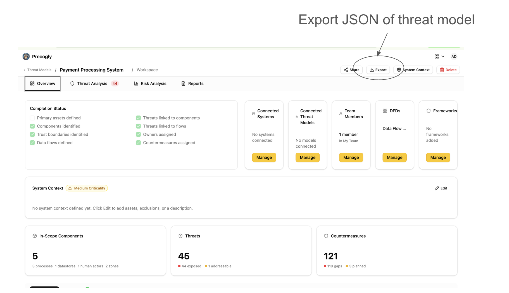
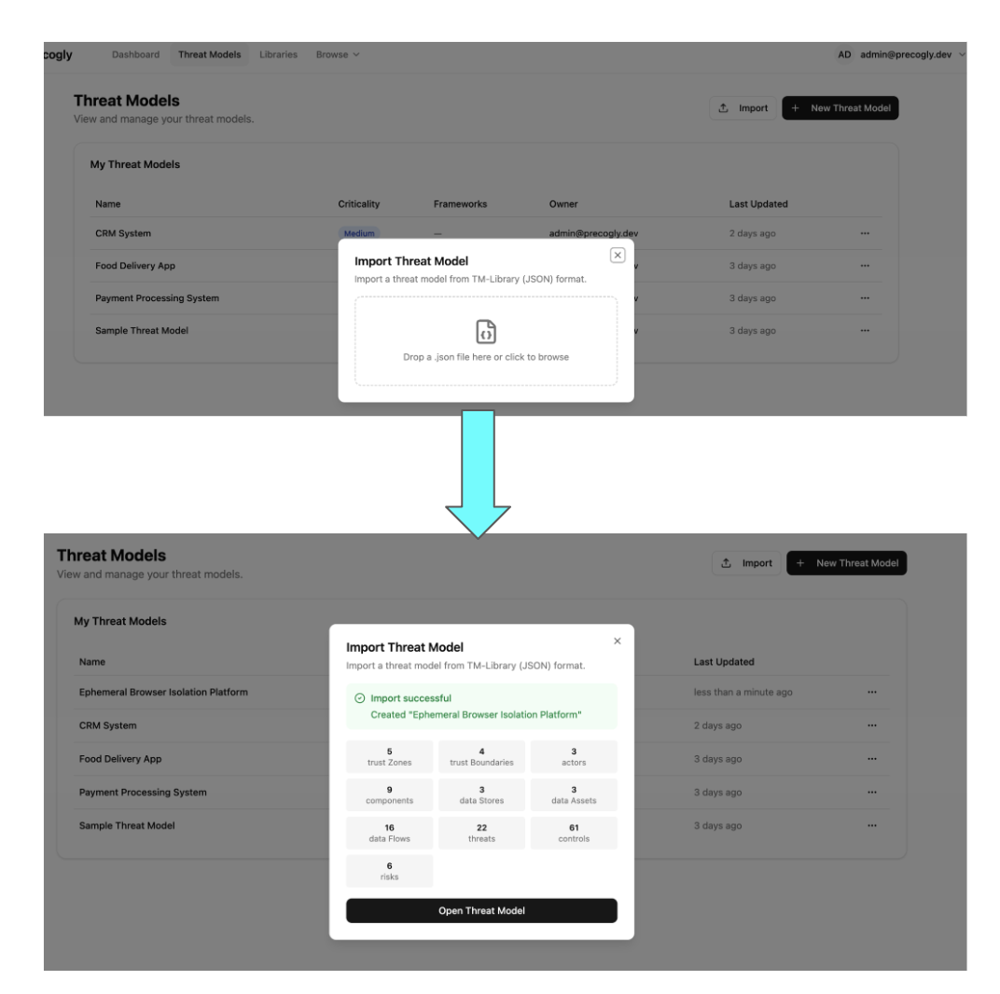

# Threat Model as Code

Precogly lets you export any threat model as a structured JSON file so you can store it in version control, diff changes over time, and integrate threat modeling into your development workflow. The same format can be imported back — making Precogly a two-way bridge between your codebase and your threat models.

## Exporting

From any threat model workspace, click **Export** and select **TM-Library (JSON)**. The browser downloads a JSON file named after your threat model (e.g., `my-api-threat-model.json`).



The export includes everything in your threat model:

- **Scope** — name, description, business criticality
- **Trust zones and boundaries** — with access control and authentication configuration
- **Actors, components, and data stores** — with trust zone assignments and parent relationships
- **Data assets** — sensitivity classifications and placements
- **Data flows** — source, destination, protocol, encryption status
- **Threats** — with taxonomy references (STRIDE, CAPEC, CWE, ATT&CK) and severity assessments
- **Controls** — status, priority, and linked threats
- **Risks** — likelihood, impact, and score
- **Assumptions** — with validity status

## Importing

On the Threat Models list page, click **Import** and drag in a JSON file (or use the file picker). Precogly creates a new threat model with all entities from the file — components, threats, controls, risks, and their relationships.



After import you'll see a summary of what was created (trust zones, components, threats, controls, etc.) along with any warnings for references that couldn't be resolved.

## The JSON format

Precogly currently uses the [OWASP TM-Library format](https://github.com/OWASP/www-project-threat-model-library) — a structured JSON schema designed for threat model interchange which is expected to evolve into the TM-BOM. Here's the top-level structure:

```json
{
  "version": "1.0",
  "scope": {
    "title": "My API Platform",
    "description": "Public-facing REST API with OAuth2",
    "business_criticality": "high"
  },
  "trust_zones": [...],
  "trust_boundaries": [...],
  "actors": [...],
  "components": [...],
  "data_stores": [...],
  "data_sets": [...],
  "data_flows": [...],
  "threats": [...],
  "controls": [...],
  "risks": [...],
  "assumptions": [...]
}
```

Every entity has a `symbolic_name` (a stable identifier like `comp_api_gateway`) that preserves cross-references across import and export. This means you can export, edit the JSON, and re-import without breaking relationships.

## Round-trip fidelity

Precogly preserves TM-Library metadata through round-trips. Fields that don't map directly to Precogly's data model (like `threat_persona`, `attack_mechanisms`, or original risk scoring values) are stored in `format_metadata` and written back on export. An imported-then-exported file retains the structure and data of the original.

## Version control workflows

Because the export is a single, human-readable JSON file, it fits naturally into existing development workflows:

- **Git history** — commit your threat model alongside code to track how the security analysis evolves with the architecture
- **Pull request reviews** — diff the JSON to review what changed in the threat model before merging
- **Audit trail** — tag releases with a snapshot of the threat model for compliance evidence
- **Templates** — export a well-structured threat model and import it as a starting point for similar projects

## Interoperability

The adapter architecture is pluggable — TM-Library is the first format, and additional adapters can be added for other standards.

## Sample files

The repository includes ready-to-import sample threat models from the [OWASP Threat Model Library](https://github.com/OWASP/www-project-threat-model-library) project under [`docs/import-export-formats/Project-TM-Library/`](https://github.com/precogly/precogly/tree/main/docs/import-export-formats/Project-TM-Library):

| File | Description |
|------|-------------|
| `husky-ai-threat-model.json` | ML pipeline with data ingestion, training, and inference |
| `hashicorp-vault-threat-model.json` | Secrets management infrastructure |
| `cryptocurrency-wallet-threat-model.json` | Crypto wallet with key management and transaction signing |
| `ephemeral-browser-isolation-threat-model.json` | Browser isolation platform with session management |

Import any of these to explore a fully populated threat model with components, threats, controls, and risks.
