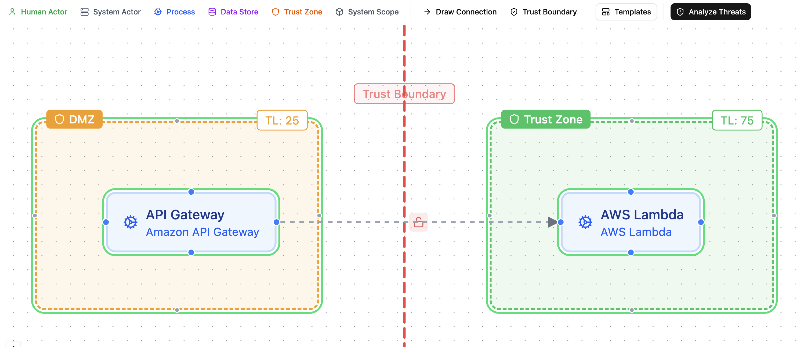
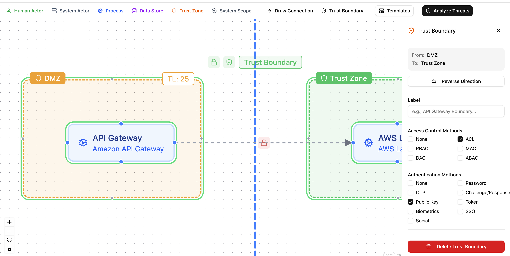
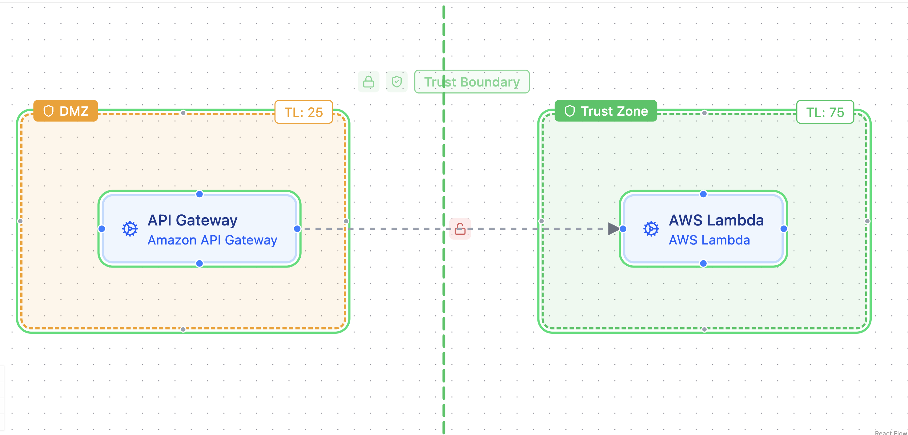
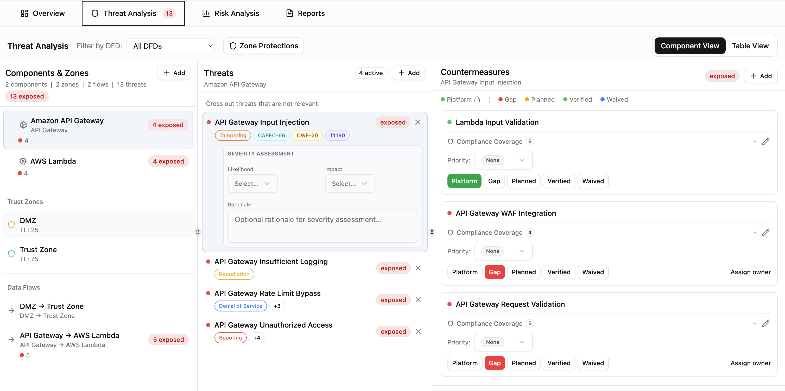
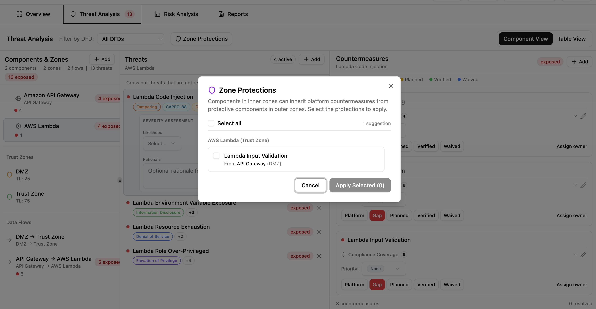
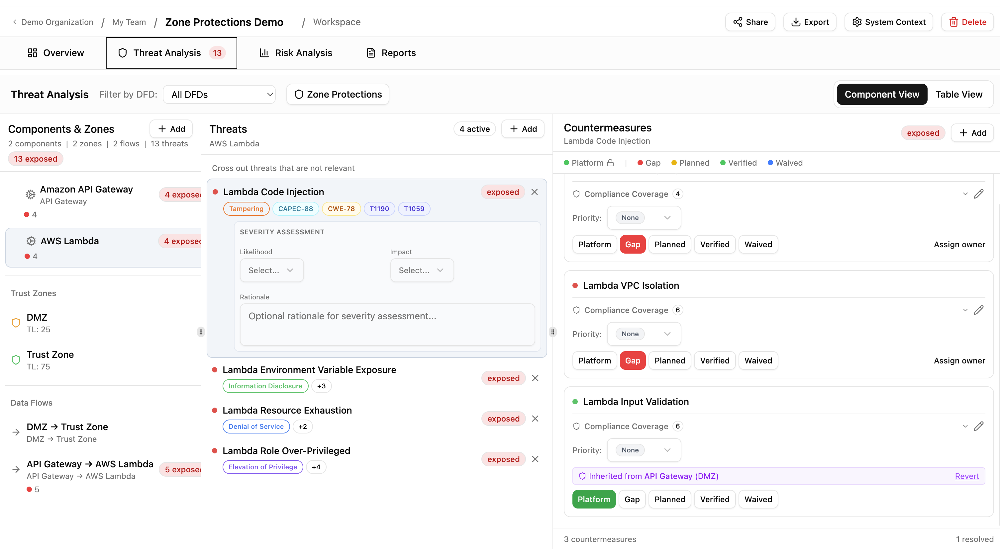

# Zone Protections

Trust zones model security perimeters in your architecture. Zone protections let Precogly recognize when outer defenses (like an API Gateway in the DMZ) already protect inner components, so you don't have to track the same countermeasure twice.

## Trust zones in the DFD editor

Trust zones are container nodes in the DFD that group components by security perimeter. Each zone has a trust level on a 0-100 scale that indicates how protected it is:

| Zone type  | Trust level | Example                                   |
| ---------- | ----------- | ----------------------------------------- |
| Internet   | 0           | Public-facing, untrusted                  |
| DMZ        | 25          | Perimeter network with WAFs, API gateways |
| Internal   | 75          | Backend services, application tier        |
| Restricted | 100         | Databases, secrets vaults, key stores     |

Drag components into a zone to assign them. Zones can be nested to model layered architectures (e.g., a Database Tier zone inside an Internal zone).

## Trust boundaries

Trust boundaries connect two trust zones and document the security controls at the crossing point. They are created using boundary mode in the DFD editor: click one zone, then click another to create a boundary between them.

A new boundary starts with no controls configured and appears as a red dashed line (not shown in the image below because the color changes to blue when the trust boundary is clicked and the side panel opens up.)

Click the boundary to open its configuration panel. Each boundary can be configured with:

- **Access control methods**: ACL, RBAC, MAC, DAC, ABAC.
- **Authentication methods**: password, OTP, public key, token, biometrics, SSO, and others.
- **Token configuration**: expiry and TTL settings.

Boundaries are color-coded based on the controls configured:

- **Red**: no authentication or access control configured.
- **Amber**: either authentication or access control, but not both.
- **Green**: both authentication and access control in place.

## How zone protections work

When a component in an inner zone (higher trust level) has a gap countermeasure, Precogly walks outward through trust boundaries to find zones with lower trust levels. If a matching platform countermeasure already exists on a component in an outer zone, Precogly suggests inheriting the protection.

For example, if an API Gateway in the DMZ (trust level 25) has a platform "Lambda Input Validation" countermeasure, and an AWS Lambda in an inner zone (trust level 75) has a gap for the same countermeasure, Precogly suggests inheriting the protection.

The system analyzes and suggests. It never auto-applies.

## Reviewing and applying protections

Open the **Zone Protections** tab in Threat Analysis to see suggestions. Each suggestion shows the target component and zone, the source component and zone providing the protection, and the countermeasure name.

Select the suggestions you want to apply and click **Apply Selected**. Applied protections are promoted to platform status and marked as inherited, with the source component and zone shown for traceability.

You can revert any inherited protection at any time. Reverted items return to gap status and reappear as suggestions on the next analysis.

## Current limitations

- Boundary controls (authentication and access control methods) are recorded for documentation purposes but do not currently influence threat generation or risk scoring.
- The boundary color coding reflects whether controls are configured, not their effectiveness. A boundary with basic password auth appears the same as one with mTLS.
