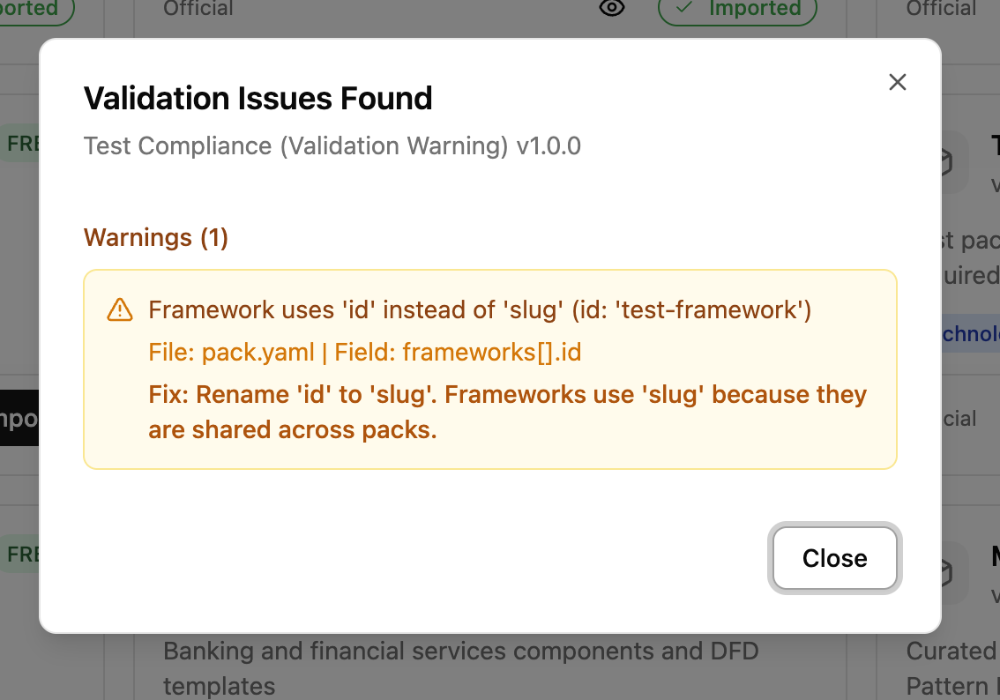
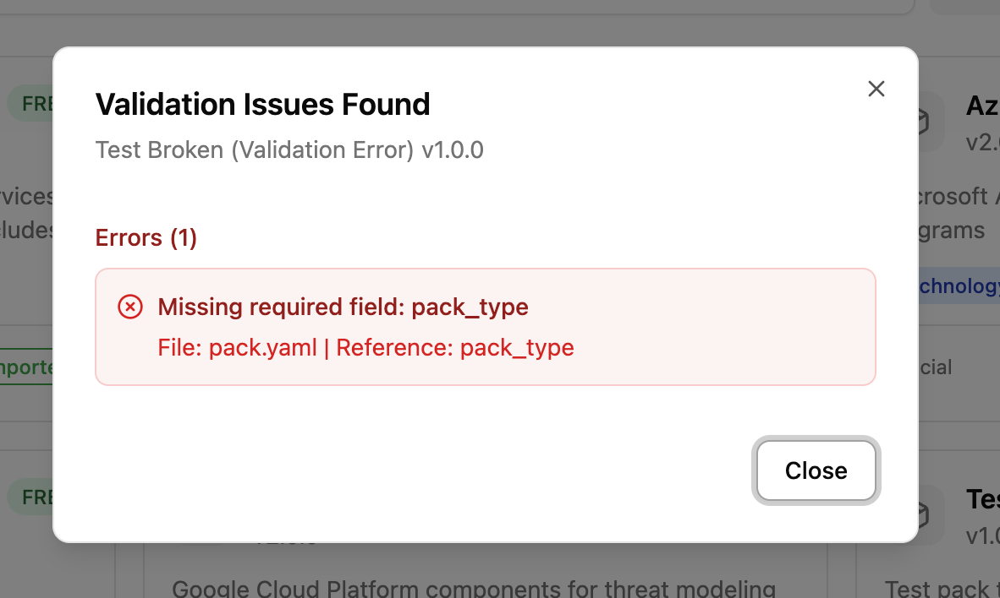

# Creating Library Packs

Library packs are modular bundles of threat-modeling content: components, threats, countermeasures, taxonomy mappings, compliance overlays, and DFD templates. They are designed for **LLM-assisted authoring with human review**. You prompt an LLM to generate the YAML, review the output for accuracy, validate it, and submit.

For background on what library packs are and how they work in the UI, see [Library Packs (Concepts)](../concepts/library-packs.md). For the complete field-level YAML reference, see [`libraries/README.md`](https://github.com/precogly/precogly/blob/main/libraries/README.md).

The canonical reference pack is **`aws-mini`** (`libraries/packs/aws-mini/`). This guide walks through its structure and uses it as the model for creating your own.

---

## Workflow overview

Creating a library pack follows five steps:

```
1. Choose pack type  →  2. Prompt an LLM  →  3. Review output  →  4. Validate & test  →  5. Submit
```

1. **Choose a pack type** and determine which files you need.
2. **Prompt an LLM** (Claude, GPT, etc.) to generate the YAML files.
3. **Review the output** for accuracy, completeness, and consistency.
4. **Validate and test** by importing the pack locally.
5. **Submit** a pull request with your pack.

---

## Choosing a pack type

Your pack type determines which files you need to create.

| Pack type | What it contains | Required files | Optional files |
|-----------|-----------------|----------------|----------------|
| `technology` | Components only | `pack.yaml`, `components.yaml` | `dfd-templates/` |
| `threat` | Threats + countermeasures | `pack.yaml`, `threats.yaml`, `countermeasures.yaml` | `joins/threats-countermeasures.yaml`, taxonomy joins |
| `full` | Everything | `pack.yaml`, `components.yaml`, `threats.yaml`, `countermeasures.yaml`, `joins/` | `dfd-templates/`, compliance overlays |
| `compliance` | Framework definitions | `pack.yaml` with `frameworks:` block (uses `slug`, not `id`) | None |
| `taxonomy` | Classification entries | `pack.yaml` with `taxonomies:` block (uses `slug`, not `id`) | None |
| `template` | DFD templates only | `pack.yaml`, `dfd-templates/` | None |

Most community contributions will be `technology` packs (adding components for a new cloud provider or tool) or `full` packs (components with threats and countermeasures).

---

## The canonical pack: `aws-mini`

The `aws-mini` pack is a `full` pack that demonstrates every file type. Use it as your template.

### Directory layout

```
libraries/packs/aws-mini/
├── pack.yaml                              # Pack metadata
├── components.yaml                        # 4 components (S3, Lambda, API Gateway, DynamoDB)
├── threats.yaml                           # ~15 threats across all components
├── countermeasures.yaml                   # ~20 countermeasures
├── joins/
│   ├── components-threats.yaml            # Which threats apply to which components
│   ├── threats-countermeasures.yaml       # Which countermeasures mitigate which threats
│   ├── threats-stride.yaml               # Threat → STRIDE mappings
│   ├── threats-cwe.yaml                  # Threat → CWE mappings
│   ├── threats-capec.yaml                # Threat → CAPEC mappings
│   ├── threats-mitre-attack.yaml         # Threat → ATT&CK mappings
│   ├── countermeasures-nist-csf.yaml     # Countermeasure → NIST CSF mappings
│   ├── countermeasures-owasp.yaml        # Countermeasure → OWASP mappings
│   ├── countermeasures-soc2.yaml         # Countermeasure → SOC 2 mappings
│   ├── countermeasures-asvs.yaml         # Countermeasure → ASVS mappings
│   └── countermeasures-cra.yaml          # Countermeasure → CRA mappings
└── dfd-templates/
    └── s3-lambda.yaml                     # Pre-built serverless DFD template
```

### Anatomy walkthrough

**`pack.yaml`** defines the pack identity and dependencies:

```yaml
pack:
  slug: aws-mini
  name: AWS Mini
  version: 1.1.0
  pack_type: full
  description: |
    A minimal AWS pack demonstrating core AWS services with associated
    threats and countermeasures.
  tier: free
  source: official
  author: Precogly
  depends_on: [stride-taxonomy, mini-capec, mini-cwe, mini-attack]
  industries:
    - technology
    - saas
  tags:
    - aws
    - cloud
    - serverless
```

Key points:

- `slug` must be unique, lowercase, hyphens only.
- `depends_on` lists taxonomy packs whose entries the join files reference. Without these, taxonomy mappings won't resolve on import.
- `source` should be `community` for external contributions.

**`components.yaml`** defines the technology building blocks:

```yaml
components:
  - id: s3
    name: Amazon S3
    category: datastore
    type: Object Storage
    provider: aws
    description: |
      Amazon Simple Storage Service (S3) provides scalable object storage
      for data backup, archival, and analytics.
```

**`threats.yaml`** defines what can go wrong:

```yaml
threats:
  - id: s3-public-exposure
    name: S3 Bucket Public Exposure
    description: |
      S3 bucket is publicly accessible, exposing sensitive data
      to unauthorized users.
```

**`countermeasures.yaml`** defines security controls:

```yaml
countermeasures:
  - id: s3-block-public-access
    name: S3 Block Public Access
    description: |
      Enable S3 Block Public Access settings at account and bucket level.
      Prevents accidental public exposure.
    control_type: preventive
    cost: low
```

**Join files** wire everything together. See [`libraries/README.md`](https://github.com/precogly/precogly/blob/main/libraries/README.md) for the full join file reference.

### Design rationale

The `aws-mini` pack demonstrates several important patterns:

- **Threat-per-component granularity**: Each threat targets a specific component (e.g., `s3-public-exposure` for S3) rather than being generic. This ensures threats are actionable.
- **Cross-component countermeasure sharing**: A countermeasure like `lambda-input-validation` can appear in multiple threat mappings, enabling [zone protections](../concepts/zone-protections.md).
- **Platform countermeasures**: Some controls use `default_status: platform` to indicate infrastructure-level controls managed by the security team. See [Platform Controls](../concepts/platform-controls.md).
- **Multiple taxonomy mappings**: Each threat maps to STRIDE, CWE, CAPEC, and ATT&CK, giving users rich classification data.

### Content ratios

As a guideline, aim for these ratios per component:

- **3-5 threats** per component
- **1-3 countermeasures** per threat
- **At least STRIDE mapping** for every threat (CWE, CAPEC, ATT&CK are valuable additions)

---

## Prompting an LLM

LLMs are effective at generating structured threat-modeling YAML. The key is giving them the right context.

### Prompt template

Use this as a starting point, adapting it to your pack:

```
I'm creating a library pack for Precogly, an open-source threat modeling platform.
The pack covers [TECHNOLOGY/DOMAIN].

Generate the following YAML files for a [pack_type] pack:
- pack.yaml (slug: [your-slug], pack_type: [type])
- components.yaml with [N] components
- threats.yaml with 3-5 threats per component
- countermeasures.yaml with countermeasures for each threat
- joins/components-threats.yaml
- joins/threats-countermeasures.yaml
- joins/threats-stride.yaml

Use these conventions:
- All IDs: lowercase with hyphens (e.g., "s3-public-exposure")
- Threat descriptions: explain what the threat is and how it occurs
- Countermeasure descriptions: explain what the control does and how it helps
- control_type: preventive, detective, or corrective
- cost: low, medium, or high
- applies_to in component-threat joins: "component", "flow", or "both"

Reference this example from the aws-mini pack for structure:
[paste a sample from aws-mini]
```

### Example prompts

**Technology pack (components only):**

```
Create a technology library pack for Google Cloud Platform covering:
Compute Engine, Cloud Storage, Cloud SQL, Cloud Functions, and Pub/Sub.

Generate pack.yaml and components.yaml only. Use pack_type: technology,
slug: gcp-core, provider: gcp.
```

**Full pack:**

```
Create a full library pack for Kubernetes covering:
Pod, Service, Ingress, ConfigMap, and Secret.

Generate all files including threats, countermeasures, and STRIDE mappings.
Use pack_type: full, slug: kubernetes-core.
Include 3-5 threats per component and appropriate countermeasures.
```

### Tips for better results

- **Provide the `aws-mini` files as context.** The more examples the LLM sees, the more consistent its output.
- **Generate one file at a time** if the pack is large. Start with components, then threats, then countermeasures, then joins.
- **Ask for specific threat categories.** For example: "Include at least one data exposure threat and one injection threat for each component."
- **Specify the taxonomy entries.** If you want STRIDE mappings, list the valid STRIDE categories: `spoofing`, `tampering`, `repudiation`, `information-disclosure`, `denial-of-service`, `elevation-of-privilege`.

---

## Reviewing LLM output

LLM-generated content needs careful human review. Check each area:

### Accuracy

- [ ] Component descriptions match the actual technology (not hallucinated features)
- [ ] Threats are real, documented vulnerabilities for that technology
- [ ] Countermeasures are actual security controls that exist and work as described
- [ ] Taxonomy mappings use correct entry IDs (e.g., valid CWE numbers, correct STRIDE categories)

### Completeness

- [ ] Every component has at least 3 threats mapped in `components-threats.yaml`
- [ ] Every threat has at least 1 countermeasure in `threats-countermeasures.yaml`
- [ ] Every threat has a STRIDE mapping in `threats-stride.yaml`
- [ ] No orphan items (threats without component mappings, countermeasures without threat mappings)

### Consistency

- [ ] All IDs follow the `lowercase-hyphen` pattern
- [ ] IDs referenced in join files match IDs defined in their respective files
- [ ] No duplicate IDs within any file
- [ ] `control_type` and `cost` values use only allowed values
- [ ] `applies_to` uses only `component`, `flow`, or `both`

### Quality

- [ ] Descriptions are specific, not generic boilerplate
- [ ] Threats describe the attack vector, not just the impact
- [ ] Countermeasures explain how to implement the control, not just what it prevents
- [ ] No unnecessary duplication between threats or countermeasures

---

## Validating and testing locally

### Automatic validation on import

Validation runs automatically when you click **Import** in the UI. If your pack has structural issues (wrong key names, invalid enum values, missing fields), you will see a dialog listing each problem with a suggested fix. Both warnings and errors block import. Fix the issues in your YAML files and re-import.

**Warnings** identify issues that would cause data loss (e.g., using `id` instead of `slug` for frameworks):



**Errors** identify missing required fields or structural problems:



### Validate via API

You can also validate explicitly using the API endpoint:

```
POST /api/packs/validate/
{"slug": "your-pack-slug"}
```

This endpoint requires **Security Team** role. It checks structural issues (metadata, enums, key names) and reference issues (broken joins, missing components).

### Common validation issues

| Issue | Message | Fix |
|---|---|---|
| Framework uses `id` instead of `slug` | "Framework uses 'id' instead of 'slug'" | Rename `id:` to `slug:` in the frameworks section of pack.yaml |
| Taxonomy uses `id` instead of `slug` | "Taxonomy uses 'id' instead of 'slug'" | Rename `id:` to `slug:` in taxonomy.yaml |
| Invalid `control_type` | "Unknown control_type" | Use `preventive`, `detective`, or `corrective` |
| Invalid `cost` | "Unknown cost" | Use `low`, `medium`, or `high` |
| Invalid `category` | "Unknown category" | Use `process`, `datastore`, `external`, `human_actor`, or `system_actor` |
| Missing `pack_type` | "Missing required field: pack_type" | Add `pack_type` to the `pack:` section |
| Missing component `id` | "Component at index N has no 'id' field" | Add `id:` to the component entry |

### Import and verify in the UI

1. Place your pack directory under `libraries/packs/`.
2. Start the development server (see [Development Setup](development-setup.md)).
3. Navigate to **Library Packs** in the sidebar.
4. Find your pack in the catalog and click to preview it.
5. Verify:
    - Components appear with correct names, categories, and descriptions
    - Threats show with their taxonomy tags (STRIDE, CWE, etc.)
    - Countermeasures show with correct control types and cost levels
    - Compliance mappings appear if you included them
6. Click **Import**. Validation runs automatically. Fix any reported issues.
7. Verify the pack imports successfully (success toast appears).
8. Create a test threat model, add a component from your pack, and confirm threats and countermeasures propagate correctly.

---

## Submission guidelines

### Pull request expectations

- One pack per PR.
- Include a brief description of what the pack covers and why it's useful.
- List the components, number of threats, and number of countermeasures in the PR description.

### Required fields

Your `pack.yaml` must include:

```yaml
pack:
  slug: your-pack-slug          # unique, lowercase, hyphens only
  name: Your Pack Name
  version: 1.0.0                # start at 1.0.0 for new packs
  pack_type: full               # or technology, threat, etc.
  description: |
    Clear description of what this pack covers.
  source: community             # use "community" for external contributions
  author: Your Name             # or your GitHub username
  tags:
    - relevant
    - tags
```

### Versioning

Follow [semantic versioning](https://semver.org/):

- **Patch** (`1.0.1`): Fix descriptions, correct taxonomy mappings
- **Minor** (`1.1.0`): Add new components, threats, or countermeasures
- **Major** (`2.0.0`): Remove or rename existing IDs (breaking change)

### License

All contributed packs are subject to the project's license. By submitting a pack, you agree that your contribution can be distributed under the same terms.

---

## Quality standards

### Minimum thresholds

| Criterion | Minimum |
|-----------|---------|
| Components | At least 3 per technology pack |
| Threats per component | At least 3 |
| Countermeasures per threat | At least 1 |
| STRIDE mappings | Required for every threat |
| Descriptions | At least 1 sentence each |
| IDs | Must match `^[a-z0-9]+(-[a-z0-9]+)*$` |

### PR review checklist

Reviewers will check:

- [ ] `pack.yaml` has all required fields
- [ ] `source: community` is set (for external contributions)
- [ ] All IDs are unique within their file and follow naming conventions
- [ ] All join file references resolve to existing IDs
- [ ] Threats are accurate and specific to the technology
- [ ] Countermeasures are real, implementable controls
- [ ] Taxonomy mappings use correct entry IDs
- [ ] No sensitive or proprietary information is included
- [ ] Pack imports successfully and renders correctly in the UI
- [ ] Version starts at `1.0.0` for new packs
