# Quickstart

A walkthrough of Precogly's core workflow using the sample threat model that ships with the demo data.

!!! info "Prerequisites"
    Make sure Precogly is running locally. See [Installation](installation.md) if you haven't set it up yet.

## 0. Log in to Django as Super Admin

When the system first gets seeded with data, it creates a superuser with which you can access the Django admin panel. To login, go to [http://localhost:8000/admin](http://localhost:8000/admin):

- **Username:** `admin@precogly.dev`
- **Password:** `admin123`

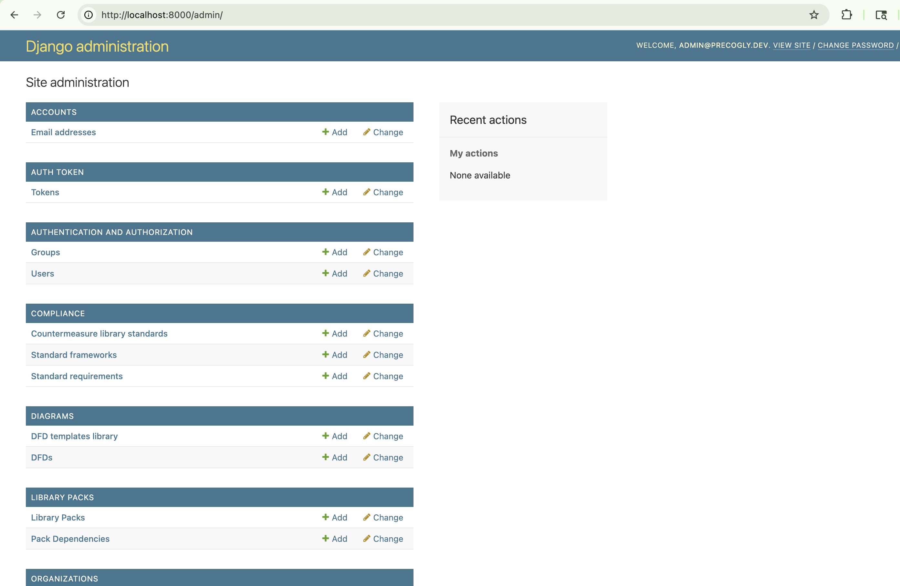

!!! warning
    Make sure to change this username and password in a production environment.

## 1. Log in

Open [http://localhost:5173](http://localhost:5173) and log in with `admin@precogly.dev` / `admin123`.

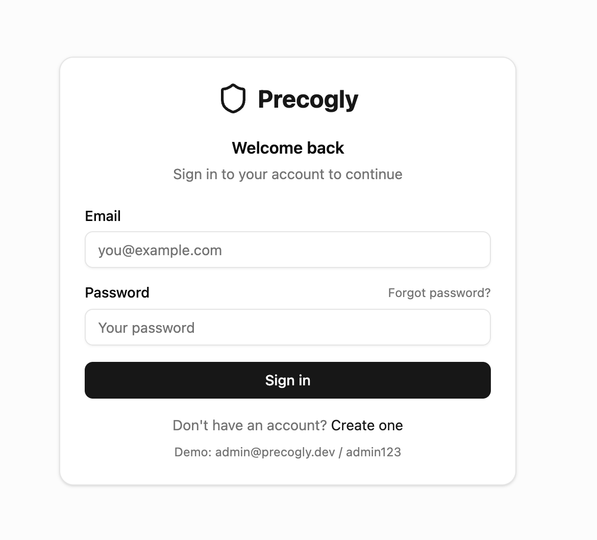

## 2. Explore the home screen

After logging in, you'll land on the home screen showing the demo organization and its sample threat model.

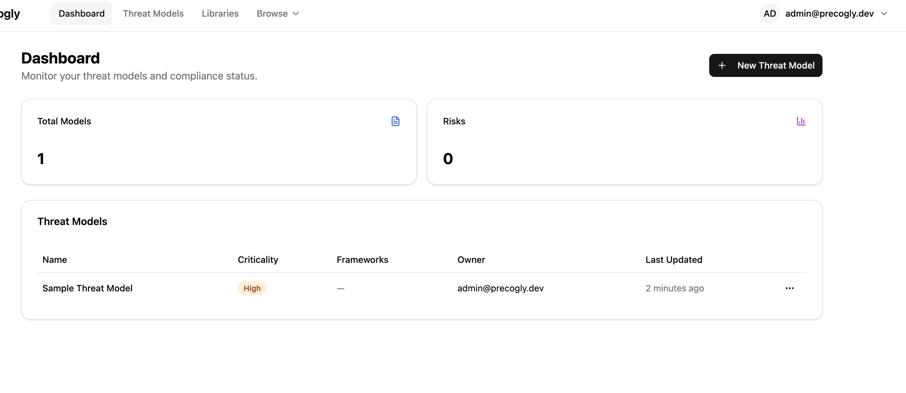

## 3. Explore the Threat Libraries

Next explore the library packs.
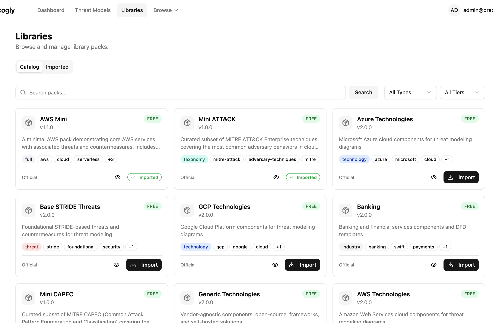

Library packs are community curated groupings of:

- Components
- Threats (with links to taxonomies like CAPEC, CWE, MITRE ATT&CK, and STRIDE)
- Countermeasures (with links to standards and requirements like ASVS, PCI-DSS, DORA etc.)

You can import library packs into your organization.

## 4. Open the sample threat model

Click on the sample threat model to open it.

## 5. Review the overview screen

The overview screen gives you a summary of the threat model and a **completion checklist** that tracks your progress. Notice that **Data Assets** is not yet checked.

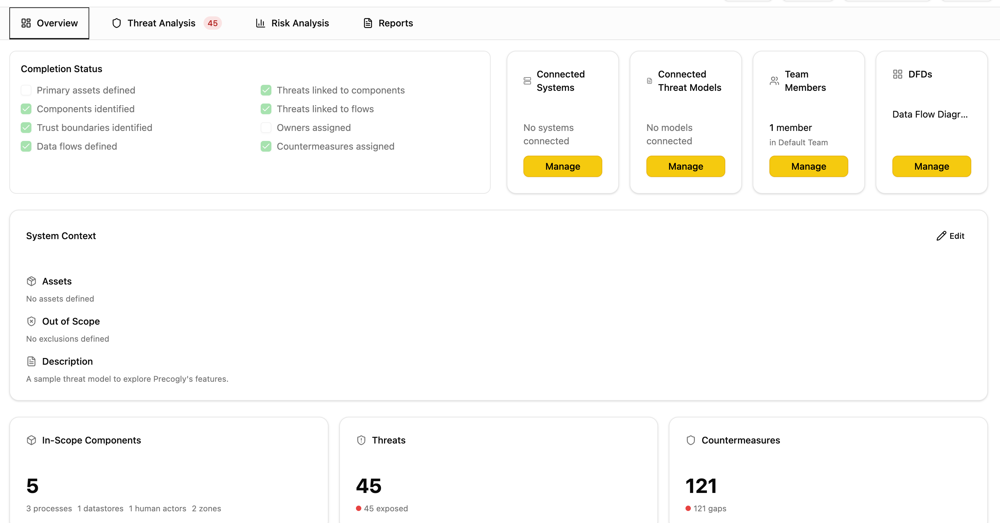

## 6. Add a data asset

Precogly allows you to add data assets to components and data flows. To add a data asset to the threat model, first click on the pencil icon in the "System Context" card, then click on the "Define Assets" button.

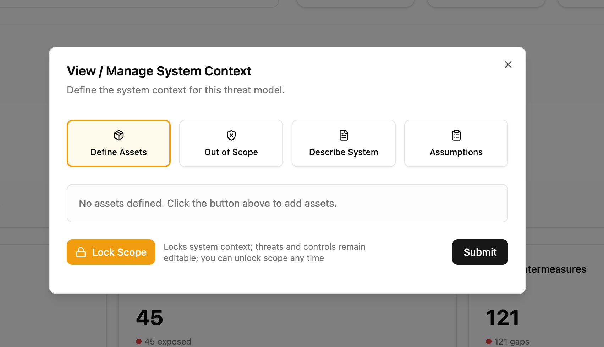

Then define the kind of data assets you want to add to your data model.

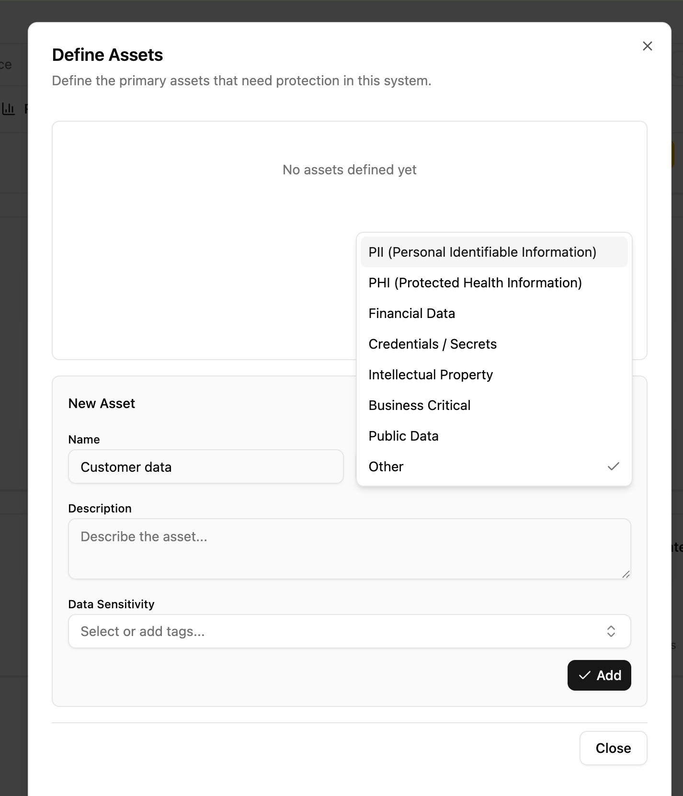

Once saved, the **Data Assets** item in the completion checklist gets checked off automatically. In case you don't see it checked, you may need to refresh your screen.

## 7. Explore the DFD editor

Navigate to the DFD editor tab (scroll down on the threat model's 'Overview' tab). The sample threat model comes with a pre-built Data Flow Diagram.

Click on different elements in the diagram — processes, data stores, external entities, and data flows — to view their details. Trust zones and trust boundaries are also visible on the canvas.

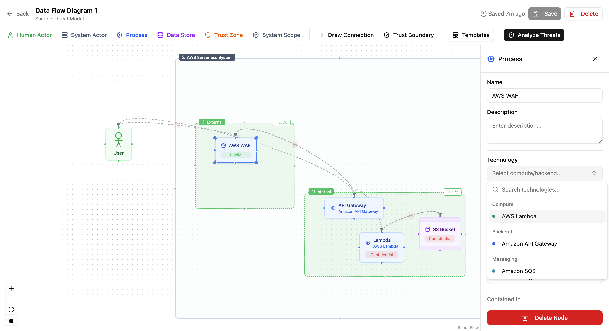

You can also select from the pre-built templates.

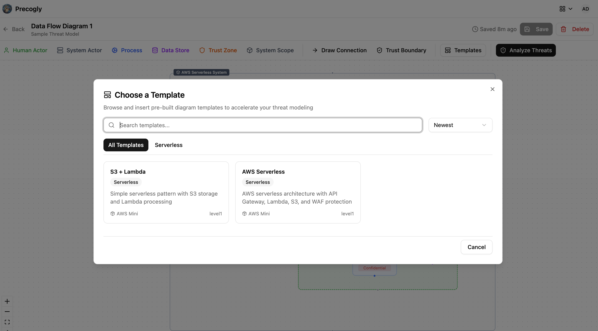

## 8. View threat analysis workspace

Navigate to the threat analysis workspace screen. This is where you review the threats identified for each component and the countermeasures to address them.

The three columns map to the core threat modeling questions:

- **Column 1** — "What are we working on?" (components)
- **Column 2** — "What can go wrong?" (threats, with taxonomy links like CAPEC)
- **Column 3** — "What can we do about it?" (countermeasures, with compliance mappings)

Taxonomy mappings come with hyperlinks to their entries, and compliance mappings are viewable on each countermeasure.

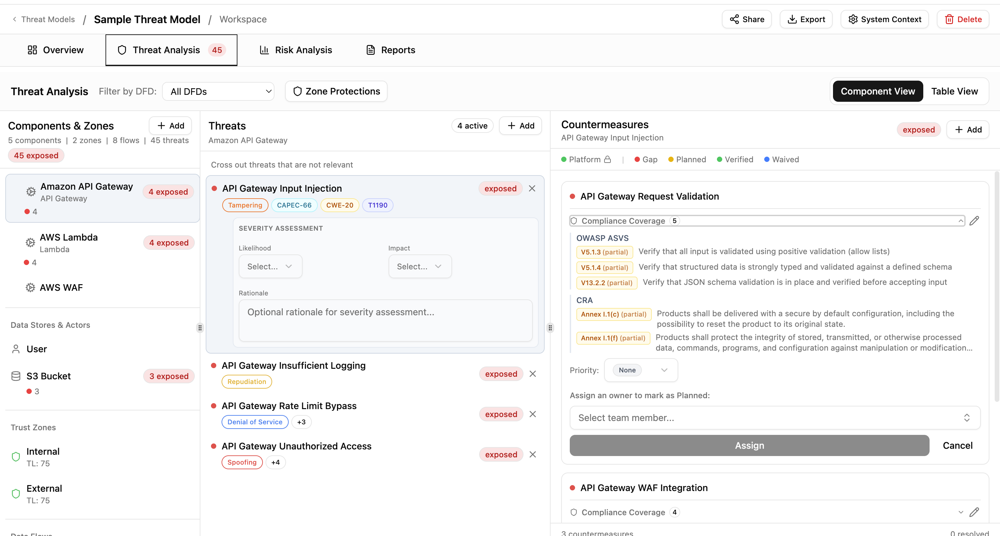

Select a countermeasure and assign it to a team member. In the demo environment, the only available user is `admin@precogly.dev`. You'll see that the countermeasure color turns from red (gap) to yellow (planned). Assigning all items under a countermeasure to team members causes the threat to move from "exposed" (red) to "addressable" (yellow).

## 9. Check your progress

Go back to the overview screen. The **Owners Assigned** item in the completion checklist is now checked, reflecting the assignment you just made. You may need to refresh the page again in case you don't see the assignment to owners.

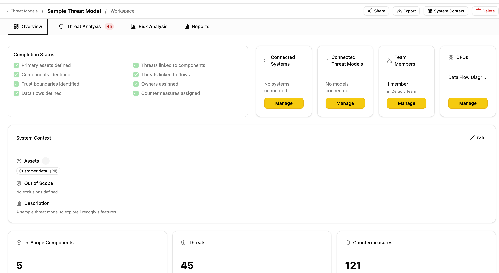

## What's next?

- [Workspaces](../concepts/workspaces.md) — understand how organizations and workspaces are structured
- [DFD Editor](../concepts/dfd-editor.md) — learn more about the diagram editor's features
- [Library Packs](../concepts/library-packs.md) — explore the curated threat and countermeasure packs
