# Creating a Threat Model

A step-by-step guide to building a threat model in Precogly, from defining scope to tracking countermeasure status. This guide covers both library-driven and from-scratch approaches, along with the access controls that govern who can do what.

!!! info "Prerequisites"
    - Precogly is running and you can log in. See [Installation](../getting-started/installation.md) if needed.
    - You have **Lead** or **Member** role on the team that will own the threat model, or you have the **Security Team** org-level role.
    - For Approach 1, at least one library pack has been imported. See [Library Packs](../concepts/library-packs.md).

---

## Who can create and edit threat models?

Precogly enforces access control at two levels. Understanding these upfront prevents confusion later.

| Level        | Role          | Can create?     | Can edit?       | Can view?      |
| ------------ | ------------- | --------------- | --------------- | -------------- |
| Organization | Security Team | Yes (all teams) | Yes (all teams) | Yes (all)      |
| Organization | Member        | Yes (own teams) | Yes (own teams) | Own teams only |
| Team         | Lead          | Yes             | Yes             | Yes            |
| Team         | Member        | Yes             | Yes             | Yes            |
| Team         | Viewer        | No              | No              | Yes            |

For full details, see [Roles and Permissions](../concepts/roles-and-permissions.md).

!!! tip
    If your organization has multiple teams, assign the threat model to the correct owning team during creation. This determines who can view and edit it.

---

## How the pieces connect

Before diving into the workflow, it helps to understand how Precogly's core elements relate to each other.

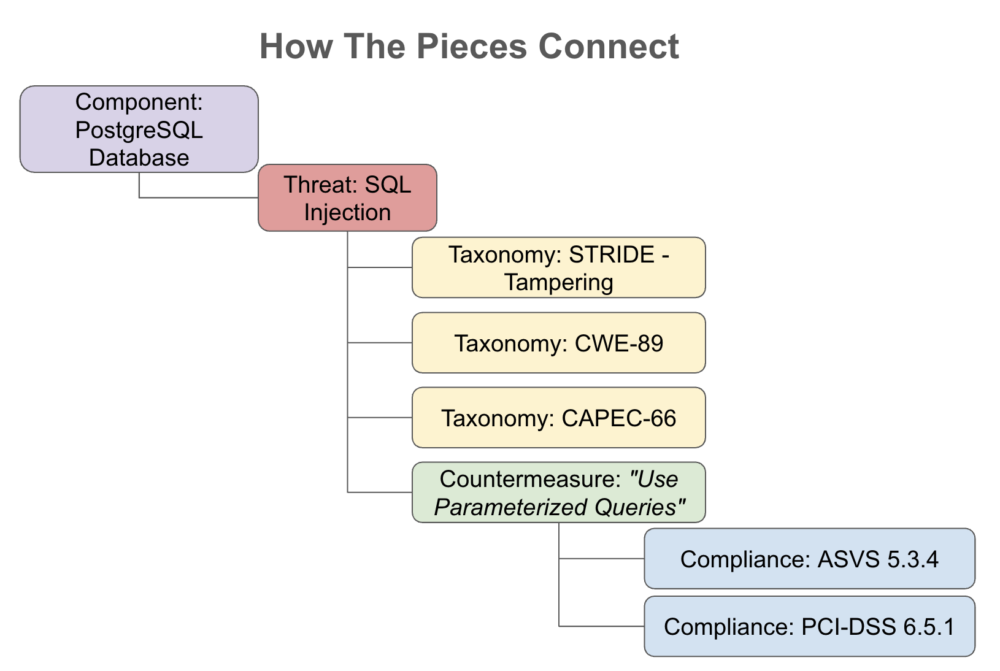

- **Components** represent the parts of your system: processes, data stores, actors, and data flows.
- **Threats** describe what can go wrong with each component. Each threat can be linked to external **taxonomies** (STRIDE, CAPEC, CWE, MITRE ATT&CK) for classification and traceability.
- **Countermeasures** describe what you can do about each threat. Each countermeasure can be mapped to **compliance requirements** (PCI-DSS, ASVS, SOC 2, NIST 800-53, etc.) to demonstrate regulatory coverage.

This chain, from component to threat to countermeasure to compliance requirement, is the backbone of every threat model in Precogly. Whether you use library packs or build from scratch, you are constructing this chain.

---

## Two approaches to threat modeling

Precogly supports two complementary approaches. You can use either one, or combine them.

### Approach 1: Library-driven

You use components, threats, and countermeasures from imported library packs. The library provides:

- Components with pre-mapped threats for each component type
- Threats with taxonomy links (STRIDE, CAPEC, CWE, MITRE ATT&CK) already wired up
- Countermeasures with compliance mappings (PCI-DSS, ASVS, etc.) already attached
- Suggested countermeasures for each threat, based on library relationships

Best suited for:

- Teams adopting threat modeling for the first time
- Standard technology stacks covered by community or official packs
- Organizations that want consistent, repeatable threat analysis across teams

### Approach 2: From scratch

You create your own components, threats, and countermeasures without relying on library packs. This means:

- Defining custom component types and names
- Writing threat descriptions and manually linking taxonomies
- Writing countermeasure descriptions and manually adding compliance mappings

Best suited for:

- Proprietary or novel systems not covered by existing library packs
- Organizations with their own internal threat catalogs or security standards
- Highly specialized domains (e.g., embedded systems, industrial control systems)

!!! tip
    In practice, most teams use a **hybrid approach**: start with library packs for common components and threats, then add custom entries for anything the library doesn't cover.

---

## Step 1. Create the threat model

From the **Threat Models** page, click **Create Threat Model**.

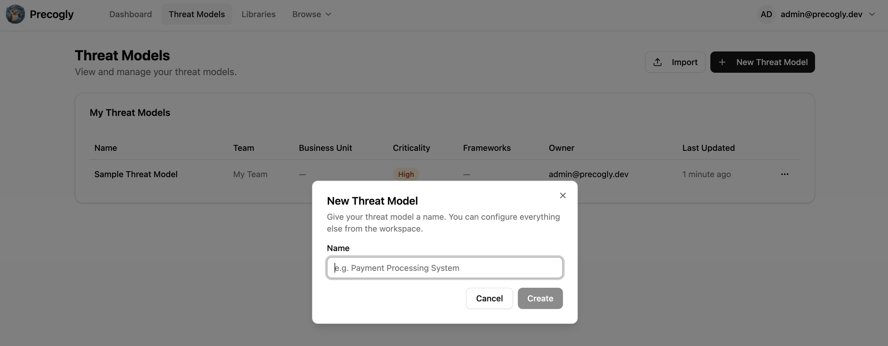

Enter a descriptive name (e.g., "Payment Processing Service" or "Customer Data Pipeline"). If you belong to multiple teams, select the owning team.

!!! note
    If you belong to exactly one team, the threat model is automatically assigned to that team.

After creation, you land on the **Overview** tab, which shows the progress checklist and summary cards.

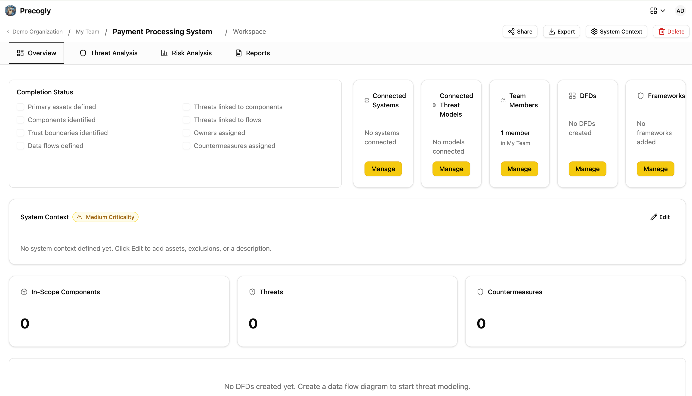

---

## Step 2. Define the system context

Click the **pencil icon** on the System Context card to open the System Context dialog. This is where you establish what is (and isn't) in scope.

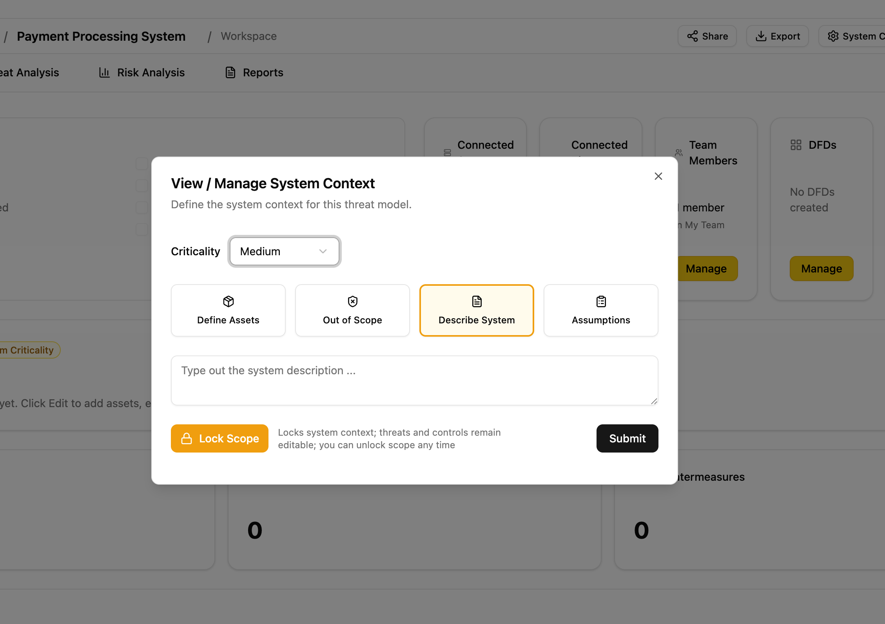

### Description

Write a description of the system being modeled: its purpose, key users, and high-level architecture.

### Data assets

Define the sensitive data the system processes. For each asset, specify:

- **Name** (e.g., "Customer PII", "Payment card data")
- **Classification** (e.g., PII, PHI, financial, credentials)
- **CIA ratings** (confidentiality, integrity, availability)

### Out-of-scope items

Document what is explicitly excluded, with justification. This prevents scope creep and sets expectations for reviewers.

### Assumptions

Record architectural or operational assumptions (e.g., "TLS 1.3 is enforced at the load balancer"). Each assumption can be marked as **unconfirmed**, **confirmed**, or **rejected** as the model matures.

---

## Step 3. Link systems and frameworks

Before diving into analysis, associate the threat model with the relevant context.

### Link systems

Click **Manage Systems** to associate existing organizational systems with the threat model. This provides traceability between business systems and their threat analysis.

### Link compliance frameworks

Click **Manage Frameworks** to associate compliance frameworks (e.g., PCI-DSS, SOC 2, NIST 800-53). Countermeasures added later will show their mappings to these frameworks automatically.

### Reference other threat models

If this system depends on or relates to other threat models, link them via **Manage Threat Models**. Relationship types include: depends on, subsystem of, related to, and superseded by.

---

## Step 4. Invite collaborators

Click the **people icon** to open the team management dialog.

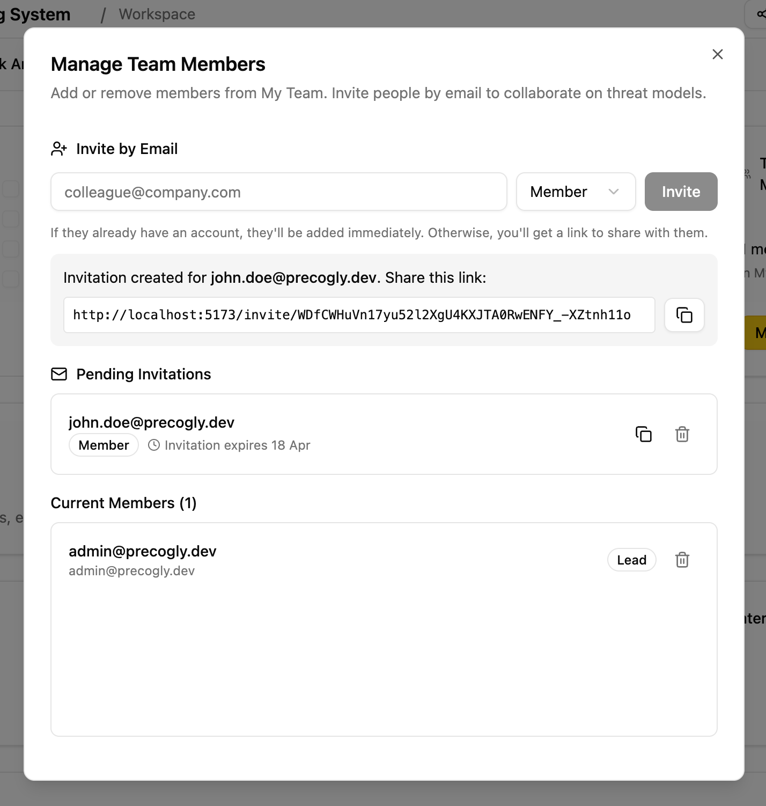

Invite team members by email and assign roles:

- **Lead**: full access, can manage team membership
- **Member**: can edit components, threats, and countermeasures
- **Viewer**: read-only access for stakeholders and auditors

!!! info
    **Security Team** members (org-level role) have unconditional write access to all threat models across the organization, regardless of team membership. They do not need to be explicitly invited.

---

## Step 5. Model the architecture

How you model the architecture depends on your approach:

- **Approach 1 (Library-driven):** You need to start with the DFD editor. When you place library components on the canvas and connect them with data flows, Precogly registers the library pack mappings and populates the threat analysis workspace with pre-mapped threats and countermeasures.
- **Approach 2 (From scratch):** The DFD is optional. You can skip the diagram entirely and add components directly in the threat analysis workspace.

### Option A: Draw a Data Flow Diagram

#### Create a DFD

From the Overview tab, click **Manage DFDs** and create a new diagram. The first diagram becomes the **primary DFD**, which syncs components and data flows to the threat analysis workspace.

#### Draw the architecture

The DFD editor provides a visual canvas. Use the toolbar to add:

| Element      | Description                                     | Icon           |
| ------------ | ----------------------------------------------- | -------------- |
| Process      | Application logic, services, APIs               | Cog            |
| Data Store   | Databases, file systems, caches                 | Database       |
| Human Actor  | End users, administrators                       | User           |
| System Actor | External services, third-party APIs             | Building       |
| Trust Zone   | Security boundary (e.g., DMZ, internal network) | Colored region |

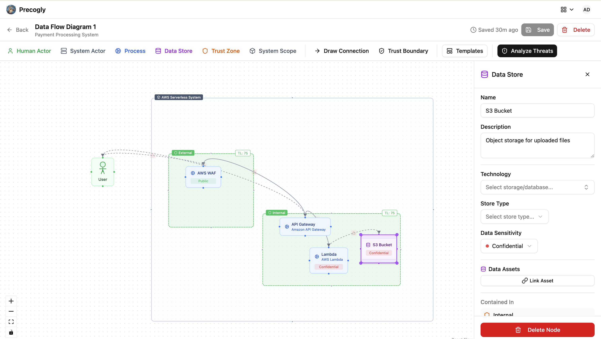

Connect components with **data flows** by clicking a component's connection handle and dragging to another component. For each data flow, specify:

- Label and description
- Protocol and port
- Whether it is encrypted and authenticated
- Whether it carries sensitive data
- Data classification

#### Use a DFD template

Instead of starting from a blank canvas, you can select a pre-built template from the library. Templates provide a starting architecture for common patterns (web applications, microservices, serverless, etc.) that you can customize.

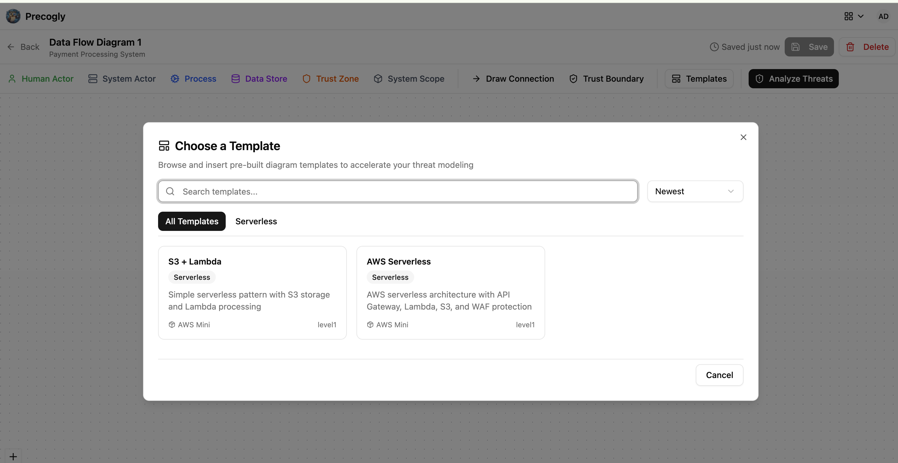

#### Add trust zones and boundaries

Trust zones represent security regions with different trust levels (0-100 scale). Place components inside zones, and Precogly will automatically detect when data flows cross trust boundaries.

For more on trust zones, see [Zone Protections](../concepts/zone-protections.md).

### Option B: Add components directly (Approach 2 only)

If you are building from scratch, you can skip the DFD editor and go straight to the **Threat Analysis** tab. Click **Add Component** to create analysis-only components. These components exist purely for threat analysis and do not appear on any diagram.

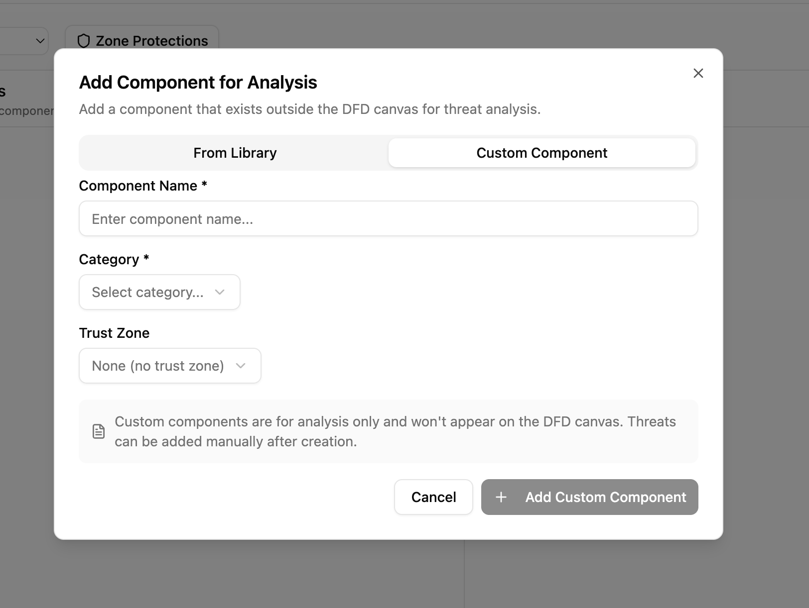

For each component, specify:

- Name and type (process, data store, external entity, etc.)
- Trust zone assignment

This is faster when you already know the system architecture and want to focus on threat enumeration.

---

## Step 6. Analyze threats

Navigate to the **Threat Analysis** tab. This workspace has three columns that map to the core threat modeling questions:

| Column              | Question                   | Contains                                                       |
| ------------------- | -------------------------- | -------------------------------------------------------------- |
| 1 - Components      | "What are we working on?"  | Components and data flows                                      |
| 2 - Threats         | "What can go wrong?"       | Threats with taxonomy links (STRIDE, CAPEC, CWE, MITRE ATT&CK) |
| 3 - Countermeasures | "What can we do about it?" | Countermeasures with compliance mappings                       |

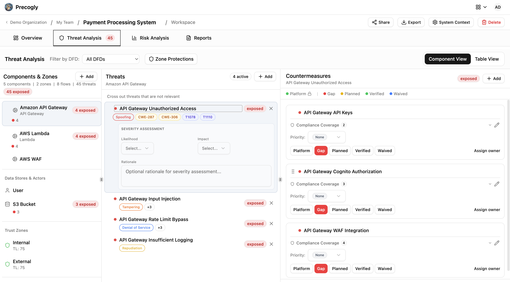

### View modes

The workspace offers two views:

- **Component View**: hierarchical tree showing threats nested under each component
- **Table View**: flat table of all threats across all components, sortable and filterable

### Adding threats: library vs. custom

**Using library packs (Approach 1):** Select a component to see threats pre-mapped from the library. Threats arrive with taxonomy links already attached. You can accept, dismiss, or reorder them.

**From scratch (Approach 2):** Click **Add Custom Threat** to create a threat manually. You write the name and description, then optionally link it to taxonomy entries (STRIDE categories, CAPEC IDs, CWE IDs, etc.).

In both cases, you can:

- **Dismiss threats** that don't apply, with a documented reason (preserved for audit)
- **Reorder threats** by dragging to set priority

### Set threat severity

For each threat, set the **inherent severity** (before countermeasures): low, medium, high, or critical. The scoring method configured on the threat model determines how severity is calculated.

---

## Step 7. Apply countermeasures

### Using library packs (Approach 1)

Select a threat to see **suggested countermeasures** from the library. These are countermeasures that the library pack has pre-mapped to this threat type. Click **Apply** to add one. Each arrives with compliance mappings already attached.

### From scratch (Approach 2)

Click **Add Custom Countermeasure** to create one manually. You write the name and description, then optionally add compliance mappings to framework requirements.

### Countermeasure statuses

Each countermeasure has a status that drives the overall threat status:

| Status   | Meaning                                     | Color  |
| -------- | ------------------------------------------- | ------ |
| Gap      | Not implemented                             | Red    |
| Planned  | Implementation scheduled or in progress     | Yellow |
| Verified | Confirmed by security team                  | Green  |
| Platform | Handled at platform/infrastructure level    | Green  |
| Waived   | Risk accepted with documented justification | Blue   |

The threat's overall status is derived from its countermeasures:

| Threat status | Condition                                            |
| ------------- | ---------------------------------------------------- |
| Exposed       | At least one countermeasure is a gap                 |
| Addressable   | All countermeasures are planned, waived, or platform |
| Mitigated     | All countermeasures are verified or platform         |

!!! note
    **Platform** status can only be set by **Security Team** members. This is used for controls managed centrally (e.g., WAF, DDoS protection, SSO). See [Platform Controls](../concepts/platform-controls.md).

### Assign owners

Assign each countermeasure to a responsible owner. This drives the progress checklist and provides accountability.

### Track compliance mappings

Countermeasures show their mappings to compliance framework requirements (e.g., PCI-DSS 6.5.1, ASVS 5.3.4). For library-driven countermeasures, these mappings come pre-attached. For custom countermeasures, add them manually.

---

## Step 8. Review zone protections

If you used trust zones in your DFD, review the zone-level protections.

Click **Zone Protections** in the threat analysis toolbar to open the review dialog. This shows which countermeasures are inherited from zone-level security controls (e.g., network segmentation, firewall rules).

For full details, see [Zone Protections](../concepts/zone-protections.md).

---

## Step 9. Score risks

Navigate to the **Risk Analysis** tab to aggregate threats into business-level risks.

### Select a scoring method

Choose the risk scoring methodology for this threat model:

| Method                  | Description                             |
| ----------------------- | --------------------------------------- |
| TM Library (5x5 Matrix) | Likelihood x Impact grid                |
| FAIR                    | Factor Analysis of Information Risk     |
| OWASP Risk Rating       | OWASP methodology with multiple factors |
| Mozilla RRA             | Mozilla Rapid Risk Assessment           |
| Custom                  | Manual score assignment                 |

### Create and score risks

Create named risks (e.g., "Customer data breach", "Service availability loss") and link them to specific threats. Precogly computes both inherent and residual risk scores based on threat severity and countermeasure effectiveness.

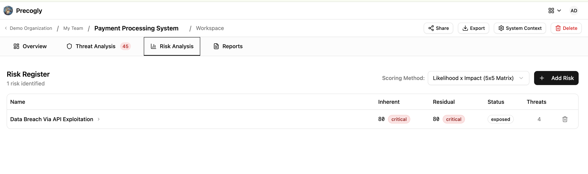

---

## Step 10. Track progress and finalize

Return to the **Overview** tab to check the progress checklist. Precogly automatically tracks:

- [x] Data assets defined
- [x] Components identified
- [x] Trust boundaries identified
- [x] Data flows defined
- [x] Threats linked to components
- [x] Threats linked to data flows
- [x] Countermeasure owners assigned
- [x] Countermeasures assigned

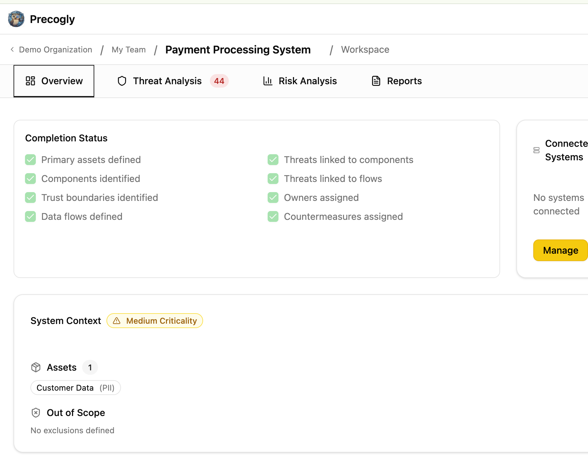

### Upload reference images

Add architecture diagrams, whiteboard photos, or other reference materials via the **Reference Images** section on the Overview tab.

### Share for review

Use **magic links** to share a read-only view of the threat model with external stakeholders who don't have Precogly accounts. Links expire after 30 days and can be revoked at any time. See [Magic Links](../concepts/magic-links.md).

---

## End-to-end workflow summary

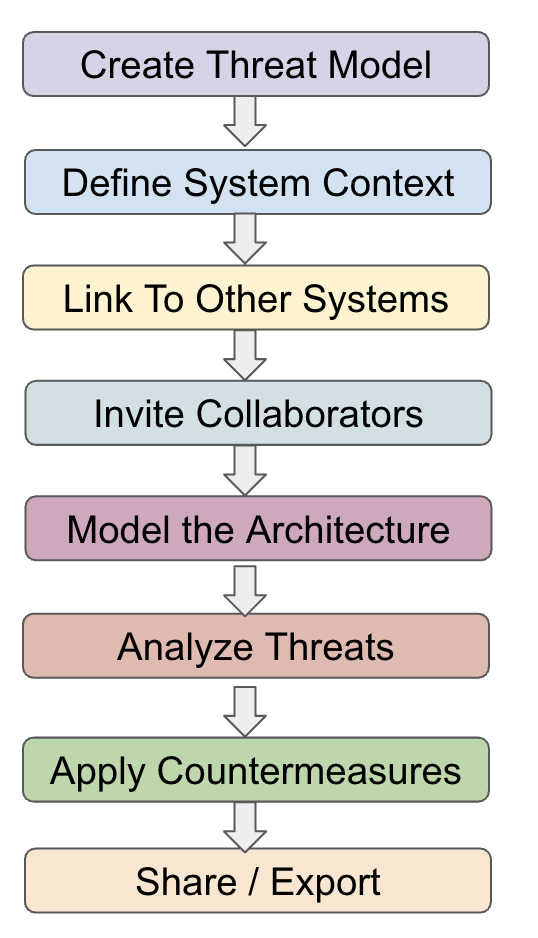

---

## What's next?

- [DFD Editor](../concepts/dfd-editor.md): toolbar, keyboard shortcuts, and canvas features
- [Threat Analysis](../concepts/threat-analysis.md): deep dive into the three-column workspace
- [Library Packs](../concepts/library-packs.md): browsing, importing, and customizing packs
- [Zone Protections](../concepts/zone-protections.md): trust zones and inherited countermeasures
- [Platform Controls](../concepts/platform-controls.md): managing org-wide security controls
- [Importing & Exporting](importing-exporting.md): threat model as code (JSON format)
- [Compliance Mapping](compliance-mapping.md): mapping countermeasures to framework requirements
