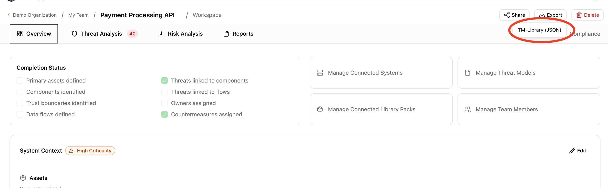
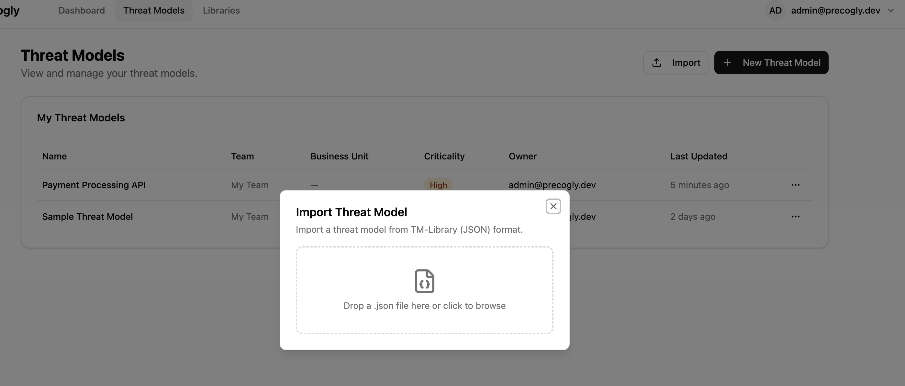

# Importing & Exporting

Precogly can export threat models as structured JSON and import them back, enabling cross-instance transfer, version-controlled threat models, and interoperability with other tools. For background on the format and version control workflows, see [Threat Model as Code](../concepts/threat-model-as-code.md).

!!! info "Format"
    Precogly currently uses the [OWASP Threat Model Library](https://github.com/OWASP/www-project-threat-model-library) JSON format (TM-Library v1.0). This is a structured schema designed for threat model interchange and is expected to evolve into the OWASP TM-BOM specification (anticipated August 2026).

---

## Exporting a threat model

### Steps

1. Open the threat model you want to export.
2. Click the **Export** dropdown in the toolbar.
3. Select **TM-Library (JSON)**.

The browser downloads a JSON file named after your threat model (e.g., `payment-processing-api-threat-model.json`).

### What's included

The export captures the full structural and analytical content of the threat model:

| Section | Fields |
|---------|--------|
| **Scope** | Title, description, business criticality |
| **Trust zones** | Name, description |
| **Trust boundaries** | Zone pair, access control methods, authentication methods, token configuration |
| **Actors** | Name, description, type, permissions, trust zone |
| **Components** | Name, description, trust zone, parent component |
| **Data stores** | Name, description, type, vendor, product, trust zone |
| **Data assets** | Name, description, sensitivity, access control methods, placements with encryption status |
| **Data flows** | Label, description, source, destination, encryption, sensitive data flag |
| **Threats** | Title, description, affected components, CAPEC attack mechanisms, CWE weaknesses |
| **Controls** | Title, description, status, priority, linked threats |
| **Risks** | Title, description, likelihood, impact, score, level |
| **Assumptions** | Description, validity, topic references |
| **Threat personas** | Name, description, skill level, access level, intent, applicability |

### Precogly extensions

Data that has no equivalent in the TM-Library schema is preserved in an `extensions` block in the exported JSON. This enables round-trip fidelity when re-importing into Precogly, while keeping the main body compliant with the standard schema.

| Data | Extension key | Purpose |
|------|---------------|---------|
| STRIDE taxonomy tags | `precogly.org/taxonomy-references` | TM-Library has no native STRIDE field |
| MITRE ATT&CK references | `precogly.org/taxonomy-references` | Not in TM-Library schema |
| Threat severity | `precogly.org/threat-details` | Inherent and residual severity, scoring metadata |
| Compliance mappings | `precogly.org/compliance-mappings` | Framework, requirement, sufficiency per control |
| Pack lineage | `precogly.org/pack-lineage` | Library slugs and pack versions for components, threats, controls |
| DFD canvas data | `precogly.org/diagrams` | React Flow node/edge positions for restoring the DFD layout |
| Trust zone hierarchy | `precogly.org/trust-zone-hierarchy` | Parent-child nesting and trust level values |
| Per-instance control details | `precogly.org/control-details` | Status breakdown when multiple instances are merged into one control |
| Workflow state | `precogly.org/workflow` | Draft/in-review/approved status, trigger, modeling mode |
| Scope metadata | `precogly.org/scope` | Scope lock state, scope assets, out-of-scope items |
| Reference images | `precogly.org/reference-images` | Base64-encoded raster images (whiteboard photos, diagrams) |

!!! tip
    When sharing with non-Precogly tools, the extensions block is safely ignored — the standard TM-Library fields carry the core threat model data. When re-importing into Precogly, the extensions restore the full analytical context.

### What's not exported

Some data is intentionally excluded because it is instance-specific or not meaningful outside the originating environment:

- **User assignments** (countermeasure owners, risk assignees) — user accounts don't transfer across instances
- **Verification tests and pentest findings** — evidence tied to the originating environment
- **Internal IDs** — database primary keys are replaced by stable `symbolic_name` references

---

## Importing a threat model

### Steps

1. From the **Threat Models** list page, click **Import**.
2. Drag a JSON file onto the dropzone, or click to open the file picker.
3. Precogly validates the file and creates a new threat model.

After a successful import, a summary shows counts for each entity type created (trust zones, components, threats, controls, etc.) along with any warnings.

!!! warning
    The import always creates a **new** threat model. It does not merge into or overwrite an existing one.

### Validation and warnings

Precogly validates the file structure before importing. Issues are reported as errors or warnings:

- **Errors** block the import entirely (missing required fields, invalid types, duplicate symbolic names).
- **Warnings** allow the import to proceed (unresolved references, unknown extensions). Entities with unresolvable references are created without those associations.

### What happens during import

Entities are created in dependency order:

1. Threat model (from `scope` and top-level metadata)
2. Trust zones
3. Trust boundaries (references zones)
4. Actors, components, data stores (reference zones)
5. Data assets and placements (reference data stores)
6. Data flows (reference actors, components, data stores)
7. Threat personas
8. Threats and component-threat associations (reference components, personas)
9. Controls and countermeasure instances (reference threats)
10. Risks (reference threats)
11. Assumptions

### How TM-Library entities map to Precogly

Some structural differences between TM-Library and Precogly are resolved during import:

| TM-Library concept | Precogly handling |
|--------------------|-------------------|
| **One threat, multiple `components_affected`** | Creates a separate `ComponentInstanceThreat` for each affected component. Precogly tracks threats per component. |
| **One control, multiple `threats`** | Creates a `ComponentInstanceCountermeasure` for each component-threat pair linked to the control. Precogly tracks controls per component-threat instance. |
| **Global control status** | Replicated to each generated instance. Users can differentiate status per component after import. |
| **`data_sets`** | Mapped to Precogly's `DataAsset` model. Placements map to `ComponentDataAsset` join records. |
| **`attack_mechanisms` / `weaknesses`** | CAPEC and CWE references are linked via the unified taxonomy model if the corresponding taxonomy packs are installed. |
| **Flat trust zones** | Imported as top-level zones. If `precogly.org/trust-zone-hierarchy` extension is present, nesting is restored. |

### Restoring Precogly extensions

If the imported file contains `precogly.org/*` extensions (e.g., from a previous Precogly export), additional data is restored:

- **Taxonomy references** — STRIDE and MITRE ATT&CK links are created if the corresponding taxonomy packs are installed on the target instance.
- **Threat severity** — Inherent and residual severity values are restored on threat instances.
- **Compliance mappings** — Control-to-framework mappings are restored if the referenced compliance frameworks are installed.
- **Pack lineage** — Precogly attempts to re-link instances to library entries by qualified slug. If the pack isn't installed, the instances remain standalone and a warning is logged.
- **DFD canvas data** — The DFD editor layout (node positions, edge routing) is restored.
- **Scope metadata** — Scope lock state, scope assets, and out-of-scope items are restored.

!!! note
    Extensions from other tools are preserved as-is during import and written back on export (pass-through). Precogly does not modify or discard unknown extension keys.

---

## Interoperability with other tools

The exported JSON validates against the TM-Library schema and can be consumed by any tool that supports it. The core threat model data lives in standard schema fields:

- **Threats** carry `attack_mechanisms` (CAPEC) and `weaknesses` (CWE) in the schema-native format, so other tools can read taxonomy classifications without understanding Precogly extensions.
- **Trust boundaries** use the standard `trust_zone_a` / `trust_zone_b` structure with access control and authentication metadata.
- **Controls** use the standard status and priority enums.

Precogly-specific data (STRIDE tags, severity, compliance mappings, pack lineage, DFD layout) lives in the `extensions` block and is ignored by tools that don't recognize it.

### Importing from other tools

To import a threat model from another tool:

1. Export the threat model from the other tool in TM-Library JSON format.
2. Import it into Precogly using the steps above.

Precogly creates standalone component, threat, and control instances from the file. These are not linked to library packs. If you later install a pack that covers the same components, you can use the library to enrich them with pre-mapped threats and compliance mappings.

---

## Sample files

The repository includes ready-to-import examples from the OWASP Threat Model Library project under [`docs/import-export-formats/Project-TM-Library/`](https://github.com/precogly/precogly/tree/main/docs/import-export-formats/Project-TM-Library):

| File | Description |
|------|-------------|
| `husky-ai-threat-model.json` | ML pipeline with data ingestion, training, and inference |
| `hashicorp-vault-threat-model.json` | Secrets management infrastructure |
| `cryptocurrency-wallet-threat-model.json` | Crypto wallet with key management and transaction signing |
| `ephemeral-browser-isolation-threat-model.json` | Browser isolation platform (most comprehensive: 11 threats, 15 controls, 6 risks) |

Import any of these to explore a fully populated threat model.

---

## What's next?

- [Threat Model as Code](../concepts/threat-model-as-code.md) — version control workflows and format overview
- [Library Packs](../concepts/library-packs.md) — importing packs to enrich threat models with pre-mapped threats and compliance
- [Creating a Threat Model](creating-threat-model.md) — step-by-step guide to building from scratch or with library packs
- [Compliance Mapping](compliance-mapping.md) — mapping countermeasures to framework requirements
