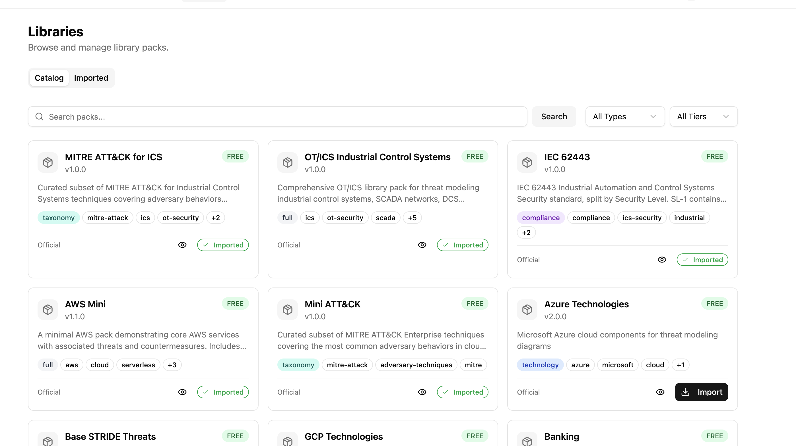
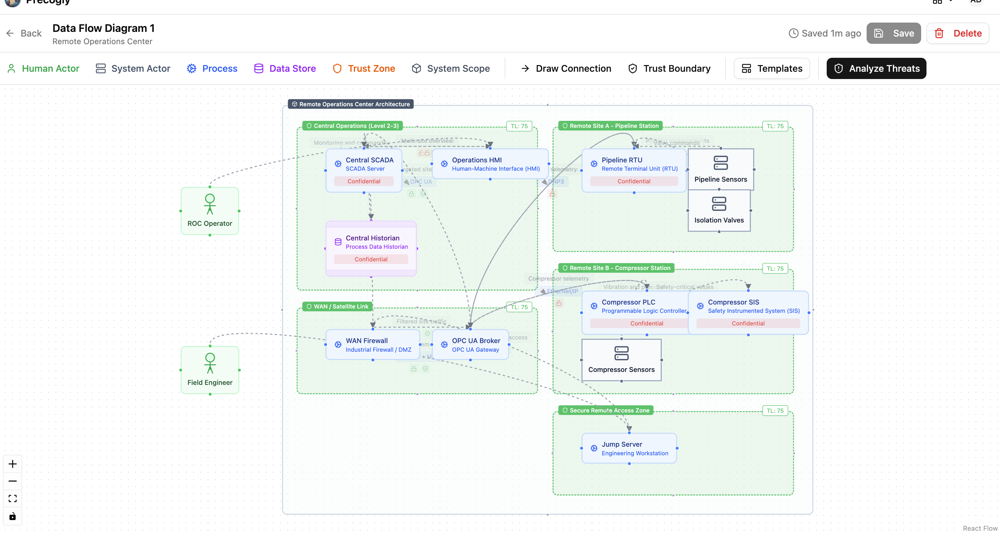
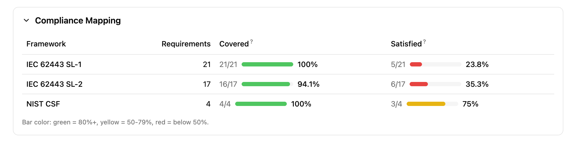
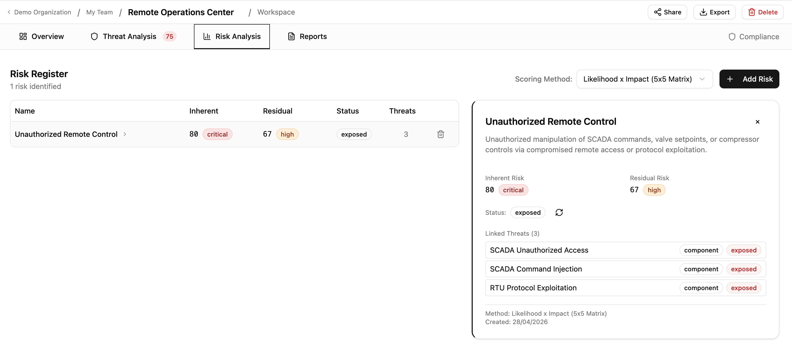

# IEC 62443: Industrial Automation and Control Systems Security

Commonly used in: Energy, Manufacturing, Utilities, Oil & Gas, Chemicals, Building Automation, Water/Wastewater

This recipe shows how to implement IEC 62443 threat modeling in Precogly, including the SL-T (Target Security Level) vs SL-A (Achieved Security Level) gap analysis. It uses a simplified Remote Operations Center as a worked example.

---

## What IEC 62443 requires

IEC 62443 is a series of standards for securing Industrial Automation and Control Systems (IACS). The parts most relevant to threat modeling are:

- **Part 3-2**: Security risk assessment and system design. Defines zones, conduits, and the process for assigning target security levels.
- **Part 3-3**: System security requirements and security levels. Defines the Foundational Requirements (FRs), System Requirements (SRs), and Requirement Enhancements (REs).
- **Part 4-2**: Technical security requirements for IACS components.

The standard defines four Security Levels:

| Level | Intent |
|-------|--------|
| SL-1 | Protection against casual or coincidental violation |
| SL-2 | Protection against intentional violation using simple means |
| SL-3 | Protection against intentional violation using sophisticated means |
| SL-4 | Protection against intentional violation using sophisticated means with extended resources |

Each level requires progressively more System Requirements (SRs) and Requirement Enhancements (REs) across seven Foundational Requirements:

| FR | Name |
|----|------|
| FR 1 | Identification and Authentication Control |
| FR 2 | Use Control |
| FR 3 | System Integrity |
| FR 4 | Data Confidentiality |
| FR 5 | Restricted Data Flow |
| FR 6 | Timely Response to Events |
| FR 7 | Resource Availability |

The requirements are **additive**: SL-2 includes everything in SL-1 plus additional SRs and REs. For example, SL-1 may require basic identification and authentication (SR 1.1), while SL-2 adds unique identification (SR 1.1 RE 1) and authenticator management (SR 1.5). SL-2 also introduces entirely new requirement areas such as continuous monitoring (SR 6.2) and control system component inventory for rogue asset detection (SR 7.8).

---

## How it maps to Precogly

IEC 62443 concepts map to Precogly features without any platform customization:

| IEC 62443 Concept | Precogly Feature |
|-------------------|------------------|
| Zones and conduits | Trust zones in the DFD editor |
| Components (PLCs, RTUs, HMIs) | Component library entries |
| Threats to control systems | Threat library with MITRE ATT&CK for ICS mappings |
| Security countermeasures | Countermeasure library with status tracking |
| Security Levels (SL-1 through SL-4) | Separate compliance frameworks per level |
| SL-T (Target) | Which level frameworks appear from countermeasure mappings |
| SL-A (Achieved) | Which level's requirements are fully satisfied |
| Gap (SL-T vs. SL-A) | Compliance report showing unsatisfied requirements |

---

## Which packs to import

Import these packs in order (dependencies first):

| Pack | Type | Purpose |
|------|------|---------|
| `stride-taxonomy` | taxonomy | STRIDE threat classification |
| `mini-cwe` | taxonomy | CWE weakness enumeration |
| `mitre-attack-ics` | taxonomy | MITRE ATT&CK for ICS techniques |
| `iec-62443` | compliance | IEC 62443 framework requirements, split by security level |
| `ot-ics` | full | OT/ICS components, threats, countermeasures, and DFD templates |



!!! tip
    If your environment also includes cloud or IT infrastructure, import additional packs (e.g., `aws-mini`, `azure`) alongside the OT/ICS pack. Precogly supports mixing packs within a single threat model.

---

## Structuring the IEC 62443 compliance pack

The key to handling SL-T vs. SL-A in Precogly is structuring the IEC 62443 compliance pack with **one framework per security level**. Each framework contains only the additional SRs and REs required at that level.

```yaml
# iec-62443/pack.yaml
pack:
  slug: iec-62443
  name: "IEC 62443"
  version: "1.0.0"
  pack_type: compliance
  description: "IEC 62443 IACS Security, split by Security Level"

frameworks:
  - slug: iec-62443-sl1
    name: "IEC 62443 SL-1"
    version: "4.2"
    issuer: "IEC"
    description: "Base security requirements (SL-1)"
    requirements:
      - section_code: "SR 1.1"
        description: "Human user identification and authentication"
      - section_code: "SR 2.1"
        description: "Authorization enforcement"
      # ... all base SRs required at SL-1

  - slug: iec-62443-sl2
    name: "IEC 62443 SL-2"
    version: "4.2"
    issuer: "IEC"
    description: "Additional requirements for Security Level 2"
    requirements:
      - section_code: "SR 1.1 RE 1"
        description: "Unique identification and authentication"
      - section_code: "SR 1.5"
        description: "Authenticator management"
      # ... only the ADDITIONAL SRs/REs for SL-2

  - slug: iec-62443-sl3
    name: "IEC 62443 SL-3"
    version: "4.2"
    issuer: "IEC"
    description: "Additional requirements for Security Level 3"
    requirements:
      - section_code: "SR 1.1 RE 2"
        description: "Multifactor authentication for untrusted networks"
      - section_code: "SR 1.9"
        description: "Strength of public key authentication"
      # ... only the ADDITIONAL SRs/REs for SL-3

  - slug: iec-62443-sl4
    name: "IEC 62443 SL-4"
    version: "4.2"
    issuer: "IEC"
    description: "Additional requirements for Security Level 4"
    requirements:
      # ... only the ADDITIONAL SRs/REs for SL-4
```

The OT/ICS pack then provides separate compliance overlay files per level:

```
ot-ics/
└── joins/
    ├── countermeasures-iec-62443-sl1.yaml
    ├── countermeasures-iec-62443-sl2.yaml
    └── countermeasures-iec-62443-sl3.yaml
```

Each overlay maps countermeasures to the requirements at that specific level.

This additive overlay structure mirrors how IEC 62443 itself works. A countermeasure like "role-based access control" satisfies SR 2.1 (Authorization enforcement) at SL-1. At SL-2, the same countermeasure may also need to satisfy SR 2.1 RE 1 (Authorization enforcement for all users), mapped in a separate overlay file. The countermeasure exists once in the model. The overlays determine which level's requirements it covers.

---

## Worked example: Remote Operations Center

The following walkthrough uses a simplified Remote Operations Center (ROC) that monitors two distributed energy sites. This is one of the pre-built DFD templates in the OT/ICS pack. The goal is to achieve SL-2 compliance (protection against intentional violation using simple means).

### 1. Create the threat model

Create a new threat model called "Remote Operations Center". Set criticality to **Critical** (compromising remote pipeline and compressor controls has direct safety consequences).

### 2. Define the system context

**System description:**

> Centralized remote operations center providing SCADA-based supervisory control over two distributed energy sites: a pipeline station (Site A) and a compressor station (Site B). The ROC connects to remote sites via encrypted WAN/satellite links through an OPC UA broker. A secure remote access zone provides jump server access for field engineers. The system handles pipeline flow control, compressor management, and safety instrumented system (SIS) monitoring across both sites.

**Data assets:**

| Asset | Category | C | I | A |
|-------|----------|---|---|---|
| Control Commands & Setpoints | Business Critical | High | High | High |
| Safety System Parameters | Business Critical | High | High | High |
| Pipeline Telemetry (pressure, flow, leak detection) | Business Critical | Medium | High | High |
| Compressor Telemetry (vibration, temperature, surge) | Business Critical | Medium | High | High |
| Central Historian Archives | Intellectual Property | High | High | Medium |
| Operator and Engineer Credentials | Credentials / Secrets | High | High | High |

### 3. Compliance frameworks (setting SL-T)

Compliance frameworks are not manually linked. They appear automatically once the threat model contains countermeasures that have compliance mappings. After you load the DFD template (next step) and save it, the OT/ICS pack's countermeasures bring their IEC 62443 mappings with them. The frameworks that appear depend on which countermeasure-to-requirement mappings exist in the imported packs.

For this example, the OT/ICS pack includes mappings to both:

- **IEC 62443 SL-1** (base requirements: SR 1.1, SR 2.1, SR 3.1, SR 5.1, SR 7.1, etc.)
- **IEC 62443 SL-2** (additional requirements: SR 1.1 RE 1, SR 1.5, SR 6.2, SR 7.8, etc.)

The set of frameworks that appear IS your SL-T. There is no separate "target level" field because the frameworks define exactly which requirements must be satisfied.

!!! info
    To expand your SL-T to SL-3, import a pack that includes countermeasure mappings to SL-3 requirements. The IEC 62443 SL-3 framework will then appear automatically in your compliance report.

### 4. Model the architecture

Open the DFD editor and load the **Remote Operations Center** template from the OT/ICS pack. The template creates:

- **Central Operations (Level 2-3)**: Central SCADA, Operations HMI, Central Historian
- **WAN / Satellite Link**: WAN Firewall, OPC UA Broker
- **Remote Site A (Pipeline Station)**: Pipeline RTU, Pipeline Sensors, Isolation Valves
- **Remote Site B (Compressor Station)**: Compressor PLC, Compressor SIS, Compressor Sensors
- **Secure Remote Access Zone**: Jump Server for field engineer access

Each component is placed in a trust zone matching the Purdue Model segmentation. Data flows show the communication paths, protocols (DNP3, EtherNet/IP, OPC UA, VPN+MFA), and encryption status.



!!! tip
    The trust zone names in the template correspond to IEC 62443 zones and conduits. Rename them to match your organization's zone and conduit diagram if needed (e.g., "Control Network (Level 0-1)", "Industrial DMZ (Level 3.5)").

### 5. Analyze threats

Navigate to the Threat Analysis tab. Because the template uses library components from the OT/ICS pack, threats are pre-populated with mappings to:

- **STRIDE** categories
- **MITRE ATT&CK for ICS** techniques (e.g., T0855 Unauthorized Command Message, T0831 Manipulation of Control)
- **CWE** weakness enumerations

For the Remote Operations Center, key threats include:

- **Unauthorized SCADA command injection** targeting the Central SCADA and OPC UA Broker
- **DNP3 protocol manipulation** on the unencrypted RTU links to Site A
- **Rogue device on field network** at compressor or pipeline sites
- **Compromised jump server** providing lateral movement from the remote access zone

Review each threat, set severity, and dismiss any that don't apply (with documented rationale).

<!-- SCREENSHOT 2: Threat Analysis tab showing threats for the Remote Operations Center
     Capture the Threat Analysis view with several threats visible, showing their
     STRIDE category tags, severity ratings, and countermeasure status. Ideally
     show a mix of threats across different components (e.g., SCADA, RTU, PLC).
     Suggested filename: iec-62443-threat-analysis.png -->

### 6. Apply countermeasures

For each threat, review suggested countermeasures from the library. Each countermeasure arrives with IEC 62443 compliance mappings already attached across the relevant security levels.

**How countermeasures map across levels:**

A single countermeasure can satisfy requirements at multiple security levels. For example:

| Countermeasure | SL-1 Requirement | SL-2 Additional Requirement |
|---------------|-------------------|----------------------------|
| Role-based access control | SR 2.1 (Authorization enforcement) | SR 2.1 RE 1 (All users, including automated) |
| Communication integrity checks | SR 3.1 (Communication integrity) | SR 3.1 RE 1 (Cryptographic integrity protection) |
| System component inventory | - | SR 7.8 (Control system component inventory) |
| Continuous monitoring | - | SR 6.2 (Continuous monitoring) |

Notice that some countermeasures (like system component inventory) only appear at SL-2 and above. Others (like role-based access control) satisfy base requirements at SL-1 and additional requirement enhancements at SL-2.

Track countermeasure status:

| Status | Meaning |
|--------|---------|
| Gap | Not implemented. Contributes to the SL-T/SL-A gap. |
| Planned | Implementation scheduled. Still a gap for SL-A purposes. |
| Verified | Confirmed implemented. Counts toward SL-A. |
| Platform | Infrastructure-level control. Counts toward SL-A. |
| Waived | Risk accepted with justification. |

### 7. Read the compliance report (Coverage vs Satisfaction)

Generate the report to see two compliance metrics for each linked framework:

- **Coverage**: the percentage of requirements that have at least one countermeasure mapped to them. This answers "do we have a plan?"
- **Satisfaction**: the percentage of requirements where at least one mapped countermeasure has status **Verified** or **Platform**. This answers "have we actually done it?"

After loading the template and saving the DFD, coverage should be high (the library provides countermeasure mappings), but satisfaction starts at **0%** because all countermeasures default to "Gap" status.



**Increasing satisfaction: a step-by-step example**

To see the satisfaction metric move, change a few countermeasure statuses to "Verified". Here are three high-impact countermeasures to start with:

| Step | Component | Threat | Countermeasure | Set status to | Requirements satisfied |
|------|-----------|--------|----------------|---------------|----------------------|
| 1 | **SCADA Server** | SCADA Unauthorized Access | Multi-Factor Authentication for Remote OT Access | Verified | SR 1.1 (SL-1), SR 1.1 RE 1, SR 1.9, SR 1.13 (SL-2) |
| 2 | **Central Historian** | Historian Data Exfiltration | Industrial DMZ | Verified | SR 4.1, SR 5.1, SR 5.2 (SL-1), SR 4.2, SR 5.3 (SL-2) |
| 3 | **SCADA Server** | SCADA Command Injection | OT Role-Based Access Control | Verified | SR 1.1, SR 1.3 (SL-1), SR 2.1 RE 1 (SL-2) |

After each change, regenerate the report. You should see the satisfaction percentage climb while coverage stays the same.

!!! tip
    For a quick demonstration, set just the first two countermeasures above to "Verified". This satisfies requirements across both SL-1 and SL-2, producing a visible contrast between the green coverage bars and the red/yellow satisfaction bars.

**How to determine your achieved security level:**

- If all **SL-1** requirements have verified or platform countermeasures: you have achieved **SL-1**
- If all **SL-1 and SL-2** requirements are satisfied: you have achieved **SL-2**
- Any SL-2 requirement still showing gaps means SL-2 is not yet achieved, even if some SL-3 requirements happen to be satisfied

**Example gap reading for the ROC:**

Suppose after implementing countermeasures:

- All SL-1 requirements are satisfied (SL-A = SL-1)
- SL-2 has 3 gaps remaining: SR 6.2 (continuous monitoring not yet deployed), SR 7.8 (no component inventory system), and SR 1.1 RE 1 (unique identification not enforced on RTU links)

Your SL-T is SL-2. Your SL-A is SL-1. The remediation roadmap is those 3 specific countermeasures.

### 8. Score risks

Navigate to the Risk Analysis tab to aggregate threats into business-level risks. For the ROC, natural risk groupings include:

- **Unauthorized remote control**: Threats to SCADA command integrity, OPC UA broker compromise, unauthorized valve/compressor commands
- **Loss of visibility**: Threats to historian data integrity, telemetry manipulation, sensor spoofing
- **Safety system bypass**: Threats to SIS independence, safety parameter manipulation
- **Lateral movement via remote access**: Jump server compromise, field engineer credential theft

??? example "Step-by-step: creating these risks"

    **Risk 1: Unauthorized Remote Control**

    1. In the Risk Analysis tab, click **Add Risk**
    2. Name: `Unauthorized Remote Control`
    3. Description: `Unauthorized manipulation of SCADA commands, valve setpoints, or compressor controls via compromised remote access or protocol exploitation.`
    4. In the **Link Threats** section, check:
        - SCADA Unauthorized Access (SCADA Server)
        - SCADA Command Injection (SCADA Server)
        - RTU Protocol Exploitation (Pipeline RTU)
    5. Click **Create Risk**

    **Risk 2: Loss of Operational Visibility**

    1. Click **Add Risk**
    2. Name: `Loss of Operational Visibility`
    3. Description: `Compromise of historian data integrity or telemetry feeds, leading to operators making decisions on manipulated or missing data.`
    4. In the **Link Threats** section, check:
        - Historian Data Exfiltration (Central Historian)
        - Any sensor spoofing or telemetry-related threats for Pipeline Sensors or Compressor Sensors
    5. Click **Create Risk**

    **Risk 3: Lateral Movement via Remote Access**

    1. Click **Add Risk**
    2. Name: `Lateral Movement via Remote Access`
    3. Description: `Compromise of the jump server or field engineer credentials to pivot from the remote access zone into the control network.`
    4. In the **Link Threats** section, check threats related to the Jump Server component
    5. Click **Create Risk**

    After creating all three, click one of the risk rows to expand its detail panel showing the linked threats.



The target security level provides context for inherent risk scoring: threats against zones with higher SL-T targets should be scored with greater severity, reflecting the higher consequences of compromise.

---

## SL-T vs. SL-A summary

| Concept | How it works in Precogly |
|---------|--------------------------|
| **SL-T** (Target) | The set of IEC 62443 level frameworks derived from countermeasure mappings |
| **SL-A** (Achieved) | The highest level whose requirements are all satisfied (countermeasure status = Verified or Platform) |
| **Gap** | Requirements in linked frameworks without verified countermeasures |
| **Remediation plan** | Countermeasures in Gap or Planned status for the target level's requirements |

---

## Single model vs duplicate modeling

Tools like [IriusRisk](https://github.com/iriusrisk/Community/blob/master/Examples/62443%20Example%201%20-%20SL-A%20to%20SL-T%20Basic%20Component) implement SL-T/SL-A by duplicating the entire system model: the same component (e.g., an RS-485 serial interface) is placed in separate trust zones for each security level. SL-1 gets one instance with its countermeasures marked "Implemented". SL-2 gets a second instance where some countermeasures are "Implemented" and others are "Required". The gap is determined by diffing the two instances.

This works, but it creates problems at scale:

| Factor | Duplicate modeling | Single model (Precogly) |
|--------|-------------------|------------------------|
| A system with 20 components targeting SL-3 | 60 component instances (20 x 3 zones) | 20 components, 3 linked frameworks |
| Adding a new component | Must be added to every level zone | Add once, compliance mappings follow from library |
| Changing a countermeasure status | Must be updated in each zone's instance | Update once, reflected across all levels |
| Reading the gap | Compare countermeasure states across zone pairs | Compliance report shows unsatisfied requirements directly |
| Architecture accuracy | DFD does not reflect the real network topology (zones represent security levels, not physical/logical zones) | Trust zones represent actual network segmentation (Purdue Model levels, DMZs) |

The last point is subtle but important. In a duplicate-modeling approach, trust zones represent security level tiers, not the actual network architecture. A "SL-2 Zone" containing a copy of every component at security level 2 does not correspond to any real zone in the facility's network diagram. In Precogly, trust zones represent the actual zones and conduits from IEC 62443-3-2, and the security level analysis happens through the compliance framework layer.

---

## Why this approach works

The platform remains standards-agnostic. The SL-T/SL-A workflow is achieved entirely through:

1. **Pack structure**: one compliance framework per security level
2. **Existing feature**: frameworks derived automatically from countermeasure mappings
3. **Existing feature**: compliance report showing requirement satisfaction status
4. **Existing feature**: countermeasure status tracking (Gap/Planned/Verified/Platform/Waived)

No custom fields, no IEC 62443-specific code, no platform modifications. The same pattern works for any standard with tiered maturity or capability levels (NIST CSF Tiers, CMMC Levels, ASVS Levels).

---

## What's next

- [Library Packs](../concepts/library-packs.md): how packs, overlays, and dependencies work
- [Creating Library Packs](../contributing/creating-library-packs.md): author guide for pack YAML schema
- [Compliance Mapping](../guides/compliance-mapping.md): mapping countermeasures to framework requirements
- [Creating a Threat Model](../guides/creating-threat-model.md): end-to-end threat modeling workflow
